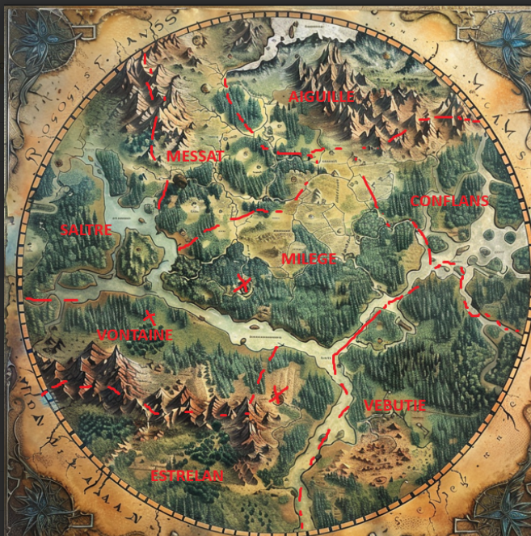

# JDR

## Personnages principaux

<table>
<tr>
<td>

Pinto (Astador)
</td>
<td>

Thalir (Nainbus)
</td>
</tr>
<tr>
<td>

Quazor (Bastoune)
</td>
<td>

Phobos (Woof)
</td>
</tr>
<tr>
<td>

Arof
</td>
</tr>
</table>

## Contexte

L'action se déroule à Gérouan, royaume encerclé totalement par un mur de plusieurs kilomètres de hauteur.
Le Dieu principal de cette contrée est **Gero**.
Notre histoire débute à Sermeille, dans le duché d'Estrelan.

Le mur qui encercle Gérouan

## Histoire

## Chapitre I - Faire ses preuves

Sermeille est la ville où habite le **duc d'Estrelan**. Son capitaine des gardes, **Victor Lapontay** (paladin), recrute pour constituer les rangs de la garde ducale.
Il est sur la place du village, accompagné de ses assistants **Jean Villeroy** (instructeur), **Matthieu Delhui**, **Paul Cassagnon** (stratégies militaires)

<table>
<tr>
<td>

Duc d'Estrelan
</td>
<td>

Victor Lapontay
</td>
</tr>
<tr>
<td>

Jean Villeroy
</td>
<td>

Matthieu Delhui
</td>
<td>

Paul Cassagnon
</td>
</tr>
</table>

**Victor** cherche à recruter des membres pour la garde ducale et, afin que les candidats fassent
leurs preuves, nous donne à tous une mission à remplir. Nous apprenons que dans un petit
patelin non loin d'ici, des enlèvements ont été signalés.
Nous sommes chargés de nous rendre dans les Marshlands pour comprendre la raison de ces enlèvements.

Nous nous rendons donc dans le village de Terp-eau et nous y rencontrons **Hugo**, le chef du village. Il nous raconte que des pêcheurs
ont disparu ainsi que des enfants, attaqués par des lézards. Il nous redirige vers **Hugo**, le fils
du meunier qui pourra nous donner plus d'infos. Ce dernier nous envoie vers les marécages en
disant que c'est de là que venaient les hommes lézards qui ont mené les attaques.

On s'engage dans les marécages et un combat contre des grenouilles commence.
Puis on arrive devant une grotte dans laquelle on rentre. On se bat contre 8 kobolds et 2
hommes-lézards qui nous ont pété la gueule. On en bute 4 mais on doit battre en retraite.
On se repose au village puis on retourne dans la grotte pour (essayer de) finir le travail.

La grotte est full vide, y a un cadavre d'homme lézard qui est mort de ses blessures.
On arrive jusque dans une salle du trône : des choses ont été enlevées à la va-vite
(on dirait qu'il manque des coffres). On trouve le bâton inamovible avec les gemmes qui font
lever et s'immobiliser les bâtons ... On finit de découvrir la grotte, on y rencontre un serpent
géant qui nous pète la gueule aussi.

Des villageois sont venus nous secourir dans la grotte, nous ramènent au village puis
jusqu'à Sermeille. On y fait notre rapport à **Lapontay** et on a rdv deux jours plus tard au
Bastion de Sermeille pour la suite de nos aventures avec la garde ducale. En attendant,
on va à la taverne d'Emberron : le Cou Grillé et on y dort pour la nuit.

Le lendemain, on fait le tour des marchands et des boutiques : le forgeron **Bertan** (éléphant)
à côté de **Geniève** (elfe) à la boulangerie (four commun entre les deux échoppes).
On va voir l'alchimiste puis dans la cathédrale pour enquêter sur le bâton inamovible.
Un prêtre nous dit que ce n'est rien de plus qu'un bâton magique qui peut être bloqué ou non
avec les boutons (Gero affirme que ce n'est rien de plus). (rien à voir avec les gemmes btw).
On se quitte sur une bénédiction de **Gero**. On se bourre la gueule avec la 'boule de feu'.
Le lendemain, on retrouve **Jean Villeroy** dans une grande cour pour le compte-rendu des missions.

On nous annonce qu'on a bien rempli la mission et qu'on est engagés dans la garde ducale.

## Chapitre II - Première mission

Ellipse : Trois mois de formation se passent.

On entend parler d'une garnison de la Faille (Sud du duché d'Estrelan, secteur 8 du mur)
qui n'a pas donné de nouvelles depuis un moment. On est donc convoqués pour mener notre
première mission. On prend la route puis une barge (on est une compagnie de 19 fantassins +
nous (**Matthieu Delhui**) + 4 scouts (**Jean Villeroy**) + 2 clercs (**Paul Cassagnon**) + **Victor Lapontay**).
On arrive au débarcadère, on prend la route pour aller jusqu'à l'endroit où la garnison se trouve
Sur le chemin, au crépuscule, on est encerclés par des sortes de mecs en haillons, une horde de
zombies sort des fourrés. Grosse bagarre (RIP ce bon vieux Jules, Donatien, Bastien, Martin, bref
tous les copains du collège y passent). On gagne, beaucoup de morts mais on s'en sort.
Bilan assez lourd, on établit un campement là pour se remettre.
On est convoqués par Lapontay dans la tente de commandement. Il a besoin que nous formions
une mission de reconnaissance pour aller voir ce qui se passe au niveau de la Faille
(entrer et obtenir des infos). On a 2 jours pour mener la mission, au-delà de quoi on sera considérés
comme morts par la compagnie.

## Chapitre III - Aux abords de la Faille

On s'avance sur le sentier qui mène à la Faille, et on finit par arriver devant un bois
qui semble maudit là où se trouvent les champs de La Faille. On la contourne et on arrive à
La Faille. On y voit une forteresse, une cathédrale avec un cimetière, la faille dans le mur
et une maison avec de la fumée en périphérie de la ville.

On s'approche discrètement de cette maison à l'orée de la forêt, on frappe. Un homme nous ouvre
avec une arbalète, une tenue de trappeur. C'est Nestor, le garde-forêt du village.

Il nous explique qu'il y a quelques jours, un pilier tout noir est apparu dans le ciel, et depuis
ce jour on croise des abominations, lentes, il a même pu reconnaître des gens du village (= zombies).
Il a essayé de rentrer dans le village pour retrouver le capitaine **Eugène Celtain** mais impossible
de le contacter. Il semble être l'un des seuls à avoir échappé à ça. Il reste le père **Rougier** qui
a toujours eu un comportement bizarre à ses yeux, et qui est maintenant toujours entouré par ces
créatures. Il n'est pas rentré dans la forêt corrompue devant le village.
Il nous recommande de buter le prêtre dès qu'on le voie si jamais on la croise, avant qu'il
ne puisse nous jeter un sort.

On longe le mur du village dans le but de traverser le village pour atteindre l'église.
On va pour rentrer dans le village en passant une porte fermée lorsqu'un groupe de zombies
nous remarque quand **Pinto** passe au-dessus du mur pour scout. Ils nous attaquent, petite baston
classique, les zombies mongolisent sur le sable du soldat de **Thalir** et on les termine.

<table>
<tr>
<td>

La Faille
</td>
<td>

Schéma de La Faille
</td>
</tr>
<tr>
<td>

Le beau Pinto
</td>
</tr>
</table>

## Chapitre IV - Le spectre et l'église

On rentre dans le village, on fouille un premier poste de garde abandonné dans
lequel on découvre des irrégularités dans les finances de la ville.

On continue de progresser dans la ville, on évite un groupe de zombies qui
semble patrouiller. Arrivés sur ce qui semble être la place du village, au
croisement des routes qui mènent respectivement à l'entrée principale de la
Faille au Nord, vers l'église à l'Est, vers le Mur et la forteresse au Sud, et
de là d'où on vient à l'Ouest. À ce croisement se tient l'auberge du Cochon
Volant, de laquelle jaillit une faible lueur. On s'y dirige en longeant les murs.

De loin, au niveau de la forteresse, on voit qu'il y a une 'foule' (probablement des zombies).
On traverse quand même la route discrètement pour s'engouffrer dans l'auberge. Une fois entrés,
**Pinto** entend une sorte de gémissement à l'étage. On monte les marches, on entend des cris de bébé,
une femme qui chantonne, des crissements. On rentre dans la chambre. Elle nous demande de calmer
son bébé. Elle nous raconte qu'elle ne sait rien du traumatisme qui a transformé les habitants,
elle nous parle de l'Appel du mur. Quand **Thalir** s'approche pour calmer le bébé dans le landau, il se
rend compte qu'il n'y a pas de bébé dans le landau. Elle se retourne vers nous, nous montrant son vrai visage
où elle ne se brosse pas les cheveux mais s'arrache la peau du visage avec son peigne. Elle se transforme
en spectre sous nos yeux et un combat s'engage.

Elle est plutôt terrifiante et nous effraie beaucoup mais on s'en sort. Une fois défaite, elle évoque
l'appel du Noyau, joue un petit air avec un appeau puis s'évanouit. **Pinto** se rapproche de l'appeau et
tente de souffler une note dedans. Rien ne se passe, il le range. On fait une petite pause avant de
repartir vers l'église, **Pinto** en profite pour se familiariser avec l'appeau.

On poursuit vers l'Est, on retraverse le mur pour sortir du village et on arrive en vue de l'église
du père **Rougier**, placée en haut d'une petite colline.
On s'infiltre dans l'église, on y récupère un journal qui relate le quotidien du père. Au jour du cataclysme (le 15),
rien n'est écrit. Ni dans les jours précédents. Son livre de prières est annoté. Le nom de **Gero** est raturé, le
symbole en forme de cercle aussi. Dans le journal, daté du 17, est écrit : 'La lumière est en moi, gloire au
Noyau'.

En repartant, on traverse le cimetière. Quelques tombes sont vides, ouvertes, pas de cercueils à l'intérieur.
Une pile de cercueils se trouve à côté, ils sont tous terreux et ont probablement été profanés/ouverts.
On finit par quitter le cimetière, contourner l'église et on souhaite s'éloigner.

Au moment de partir, un homme-corbeau en tenue de prêtre nous interpelle depuis le parvis de l'église. Il s'agit
du **père Rougier**, qui nous invite à rentrer dans son église.

Il nous a dit qu'il avait déposé plainte pour des histoires de pilleur de tombes mais qu'elles étaient
restées sans retour. De temps en temps, il réalise qu'une des tombes a été ouverte. Il avait porté plainte
auprès du capitaine Eugène Celtain mais que rien n'a été fait depuis.

Il nous dit qu'il était un serviteur de **Gero** mais qu'il est maintenant un adorateur du Noyau, qu'il présente comme
la paix ultime, une lumière au calme infini, qui nous appelle. Le jour du cataclysme, où il pensait que **Gero** l'avait
abandonné, une colonne est apparue dans le ciel, et la vérité lui est apparue. Les créatures zombies ont, selon lui,
reçu un don du **Noyau**. Il ajoute que la forêt est bizarre, que des gardes y ont été mobilisés et qu'ils ne sont
jamais revenus (paroles rapportées par les femmes des gardes à **Rougier**).

On repart vers le camp de **Lapontay**. Sur le chemin, on rencontre **Serge**, **Sébastien** et **Thibault** qui ont eux aussi
été envoyés en reconnaissance, on les met en garde contre les dangers du village et de la forêt, et on arrive
finalement au camp.

## Chapitre V - Infiltration dans la forteresse

Retour au camp, on se rend sous la tente de commandement où se trouvent **Victor Lapontay** et ses lieutenants.
**Pinto** fait le rapport de tout ce qu'on a traversé dans le village.
**Victor** demande à **Jean Villeroy** d'aller chercher la patrouille qu'on a croisée sur le chemin du retour, et on choisit de
refaire un point le lendemain.

**Pinto** teste sa flûte, elle produit un sentiment de malaise profond chez **Thalir**, qui lui intime très fermement d'arrêter. **Pinto** a la sensation de pouvoir "ressentir" les gens qui sont touchés par ce "sortilège".
Le lendemain, la patrouille est finalement revenue (sans **Serge** putain ...).
**Lapontay** choisit de mettre en place un plan pour atteindre la forteresse : Forcer une bataille avec l'armée qui encercle
la forteresse pour que notre petite équipe parvienne à s'infiltrer dedans pendant la diversion créée par **Lapontay**.

Sur le chemin, on passe par la forêt "maudite", **Lapontay** casse une branche d'un arbre et y découvre un épée, enserrée
dans le bois. On repasse par la maison du garde-forêt **Nestor**, mais elle est vide. Son arbalète n'est plus là. Il semble parti
de son plein gré mais personne ne l'a croisé parmi les éclaireurs.
On rentre dans le village, on rentre tous dans une maison et on se synchronise avec **Lapontay** pour que l'assaut et notre intrusion
soient bien calées. Il nous révèle l'emplacement d'une trappe sous un ballot de paille à l'arrière de la forteresse,
qui fait office de point d'entrée ou de sortie de secours, par laquelle on va s'infiltrer.

Sur le chemin vers l'entrée dérobée, on trouve le cadavre de **Serge**, en sang. Il s'est arraché les oreilles.

Arrivée aux abords de la forteresse.

Le parvis est rempli de créatures, majoritairement des femmes. Environ 300 individus massés devant la forteresse, tournés vers
elle, tête baissée. En ce qui nous concerne, on ressent des sortes de pulsations sourdes et lancinantes qui nous affectent
par vagues. De là d'où on est placés, on repère l'étable où on pourra s'infiltrer.

Au bout de quelques temps, on entend une grosse explosion, les morts-vivants se tournent vers le lieu de l'explosion et s'y
dirigent. La place est vide au bout de quelques minutes, on se rend vers l'étable, on retire les ballots de paille, on
enfonce la porte qui était grippée, et on rentre dans le tunnel qui est derrière.

On arrive dans une grande cour d'entraînement pour soldats, et la forteresse est au centre. On la contourne et on rentre
par une petite porte en bois à l'arrière. Première salle : plein de râteliers avec des armes + armes d'entraînement.
Puis vient un mélange entre un patio et un cloître (un cloitio ou un pâtre ?). Puis vient un grand dortoir. Les
sentiments de fourmillement et d'acouphènes se font sentir très fort, ça semble venir d'en-dessous de nous. **Pinto**
sent quelque chose de magique au-dessus de nous. Puis vient un potager. On rebrousse chemin et on prend une autre porte.
Une salle entièrement carrelée : la salle de bains. On rebrousse encore chemin, on retourne vers l'entrée et on découvre
ensuite le hall d'entrée de la forteresse, avec ses escaliers (l'un descendant, l'autre ascendant).

Nous choisissons de monter.
A l'étage, on trouve une sorte de salle de commandement avec des plans, des bibliothèques remplies de livres de tactiques militaires.
Des documents concernant des rapports de patrouilles qui s'inquiètent de voir des formes de l'autre côté du Mur, ainsi que des rapports
du garde forestier **Nestor** qui a été mandaté pour mener des patrouilles de reconnaissance. On garde ces documents. On retrouve aussi un
papier roulé en boule qui est une demande du prêtre **Rougier** qui parle des profanations de sépultures. La garde en mode osef de ça vu que
c'est roulé en boule.

Ensuite vient une petite chambre, rien de bien reluisant mais l'instinct de détection de la magie de **Pinto** le pousse à ouvrir une commode
dans laquelle il trouve deux pierres de la taille d'un kiwi, pleines d'alvéoles, qui ressemblent à des oreilles ou des bouches. L'une est
marron et porte le blason de Sermeille. L'autre, grise, en mauvais état (fissurée et polie par le temps) n'a pas de symbole particulier.
**Pinto** les emporte.

On redescend par les escaliers jusqu'à la cave. Ca pue sa mère, ça sent la mort, ça pulse à mort.
On ouvre une porte, une vague d'air chaud et fétide nous prend à la gorge, nos oreilles sifflent comme jaja. Dans le coin de la pièce qu'on
vient de découvrir, on trouve une pile de corps en décomposition. Plutôt bien habillés, certains sont encore bien terreux. Ils semblent
donc appartenir aux gens enterrés dans le cimetière qui ont été profanés. Il y a aussi des branches de bois entre les corps.

Il y a une fissure dans le mur, c'est de là que proviennent les pulsations et les acouphènes qu'on entend jusque là. Une autre porte donne
sur un couloir avec quelques cellules et les grilles sont fermées.
Dans une des cellules, il y a une sorte de tas de bois, presque comme un buisson biscornu. Dans la dernière cellule, un mort-vivant est
enfermé, le regard fixe.

**Thalir** rentre dans la cellule du buisson grâce à la TP du echo knight. Il a l'air de deviner une forme humanoïde dans le buisson.
Il y met le feu, ça prend vite, il finit par l'éteindre avec le chevalier de sable. On entend tousser au fond du couloir. **Quazor** s'avance
jusqu'au fond de la cellule et y découvre un prisonnier, avec quelques réserves de bouffe et une armure dans un coin.

Il nous demande de l'aide pour sortir. Il nous raconte qu'il s'est emprisonné tout seul pour se planquer. Les clés sont dans la pièce
avec les cadavres. Il nous explique qu'après le Cataclysme, il a compris qu'il ne pouvait plus vraiment quitter la forteresse et a fini par
se coincer là. Il nous montre sa main, sertie d'un anneau magique qui semble le protéger des pulsions sonores qu'on entend depuis le début (cadeau de sa mère qui lui a donné comme un talisman).
On finit par nous donner son nom : **Iber**. On fait un deal de le libérer et il nous aide à sortir de ce merdier.

Il nous explique que le buisson, c'est ce qu'il y a derrière le Mur. La forêt devant la ville, c'est la Garde qui a été transformée
en arbres après avoir été amassée à la sortie. Il dit que c'est comme ça qu'ils se battent, "ça" dit-il en crachant sur le buisson brûlé. Il ne sait pas relier les zombis
et la forêt. tout est arrivé en même temps mais il n'en sait pas plus. Le prêtre a probablement le même anneau que **Iber** car **Pinto**
avait senti la même forme de magie que sur **Iber**. Il trouve ça bizarre que Nestor revienne seul des excursions en extérieur. Il
ne lui fait donc pas confiance.

**Pinto** fait un test de flûtiau sur le zombie, qui réagit très négativement.

On se rapproche de la faille dans le mur, d'où sort une brume noirâtre et putride qui dégouline, une légère lumière rouge et verte
pulse entre les murs que l'on parcourt.

## Chapitre VI - La fissure dans le mur

On parcourt ce tunnel sur quelques mètres, qui semble creusé à la main. Au fur et à mesure qu'on avance, une sort de mousse et des
buissons putréfiés sont de plus en plus envahissants.
Au bout du tunnel, on tourne et on arrive dans une salle plus évasée où se tient un humanoïde de 3 mètres de haut se dresse devant nous,
son corps entièrement fait de bois. La moisissure est omniprésente. Les volutes de fumée noire viennent de lui, les pulsations aussi.
La pièce est recouverte de runes.

Au moment où on s'avance vers elle, la dryade s'éveille et le combat s'engage.

<table>
<tr>
<td>

Dryade 1 dmr
</td>
<td>

</td>
</tr>
<table>

**Iber** plante une unique flèche de tout le fight, et le combat est gagné sur un triple kill de **Quazor**.
A sa mort, la fumée de la créature se concentre dans une pierre noire, qui semble pulser d'une lumière un
peu violette. Les sensations qu'on ressentait auparavant sont encore sensibles, mais drastiquement plus
faibles. Il s'agit très probablement du Noyau.

**Iber** remarque, à l'endroit où le monstre était attaché, un parchemin rempli de notes : "L’expérience touche à sa fin. Il est grand temps que
nous regagnions ce qui nous est dû, notre vengeance est proche". C'est probablement une sorte de preuve qu'on devrait garder précieusement.

**Thalir** récupère aussi un livre sur une étagère, il est écrit dans une langue que personne ne sait déchiffrer.

On ressort de la forteresse, **Pinto** s'envole et réalise que la troupe de Lapontay s'est probablement fait prendre en tenailles, il n'y
a plus aucun mouvement visible. On décide de s'approcher du lieu du massacre pour essayer de comprendre ce qui s'est passé. On croise de
nombreux cadavres de zombis, puis au fur et à mesure, on voit aussi les cadavres de nos compagnons, dont beaucoup ont des carreaux d'arbalète
plantées dans le dos. **Jean Villeroy** fait partie des morts que l'on aperçoit.
Les zombis n'ont ni arcs ni arbalètes, les carreaux doivent donc venir d'ailleurs.

On retourne jusqu'à la maison dans laquelle on avait établi le plan initial. Dedans, de nombreux autres soldats, dont **Paul Cassagnon**.

Encore plus loin, on y découvre le corps de **Lapontay**, au bord du décès. Il nous intime de nous rendre à Sermeille en nous tendant son
épée. Il est heureux que nous nous en soyons sortis, puis décède pour de bon.

**Nestor** nous surprend, en embuscade sur un toit, et nous intime de nous dire ce qu'on a trouvé dans la forteresse.
**Thalir** le baratine un peu jusqu'à ce que **Matthieu Delhui** surgisse derrière lui et le tue d'un coup d'épée, avant
de lui aussi tomber du toit et s'effondrer au sol. Agonisant, **Nestor** n'a pas le temps d'expliquer quoi que ce soit non plus
même s'il a l'air de dire que ce qu'on y a trouvé doit être extrêmement important.

Sur son cadavre, on trouve un anneau maculé de sang qui ressemble à celui d'**Iber**, ainsi qu'un sac de 12 graines, qui ressemblent à des haricots. **Quazor** le récupère.

<table>
<tr>
<td>

</td>
<td>

</td>
<td>

</td>
<td>

</td>
</tr>
<table>

On sort de la ville, on se rend à la maison de Nestor pour la fouiller au cas où on y trouve des infos supplémentaires et s'y reposer.

## Chapitre VII - La Faille, les preuves, les anneaux et pierres de communication, les zombis par milliers

**Thalir** se concentre sur le Noyau. Il sent une sorte d'énergie maléfique qu'il se sent maintenant capable de rediriger, mais il ne sait pas comment l'expulser ou vraiment la conserver mais bon voilà c'est là quoi.

**Pinto** se concentre sur la pierre ornée du blason de Sermeille. Il semble entendre des pas et des cloches. En tentant de siffloter "La Ballade de Gero", il semble que son sifflement soit absorbé par la pierre.

Le père **Rougier** se met à parler à **Quazor** au travers de l'anneau récupéré sur le cadavre de Nestor. Il dit qu'il est "là" mais **Quazor** ne l'entend que dans sa tête. **Rougier** entend tout ce qu'il dit tant qu'il porte l'anneau. Lorsqu'il porte l'anneau, il se sent apaisé. Quand il l'enlève, le père **Rougier** ne peut plus communiquer.

**Pinto** se rend compte qu'il a de plus en plus envie de jouer de la flûte devant la pierre bizarre avec le blason de Sermeille. On sort de la maison pour le laisser faire sans en subir les conséquences (30 ft de portée). Il arrive à projeter l'énergie de la flûte dans la pierre. Il a l'impression de ressentir quelque chose de très vague, de très lointain vers le Nord, de vivant.

**Iber** accepte de nous accompagner voir le prêtre pour y voir plus clair.

En arrivant près de l'église, on remarque que la porte est grande ouverte, et que le sol semble avoir été piétiné. Il y a eu du passage entre la ville et l'église, ils se rendent tous vers la ville en partant de l'église. Les empreintes sont profondes, récentes (max quelques heures). Sur le parvis de l'église, on remarque une longue forme noire allongée par terre.
Le père **Rougier** est étendu à terre, un carreau planté dans l'oeil, mort.

On se retourne vers **Quazor**, qui explique que c'est bien sa voix qu'il entend, qui ne s'est pas rendu compte qu'il était mort. On réalise qu'il n'a plus son anneau, et pourtant il continue à nous parler, il parvient même à nous voir, il nous demande de respecter son corps et de ne pas lui voler d'objets.
**Iber** retire son anneau pour voir si ça a un impact mais non, **Rougier** continue à parler à **Quazor**. Il précise d'ailleurs qu'il ne veut pas être enterré dans le cimetière, il préfère rester là.

On ne parvient pas à en apprendre beaucoup plus via le père **Rougier**, donc on rentre dans l'église, dans laquelle il n'y a plus aucun symbole de **Gero**.
Austèrement décorée, il n'y a rien de particulier dedans qui éveille notre curiosité. On ressort de l'église dans le but de se diriger vers la Faille.

En y arrivant, on trouve des tours de garde dans lesquelles il y a des arbres là où on s'attendrait à trouver des soldats. Un parterre de plantes quitte la Faille et remonte vers le Nord. Ce sont des plantes inconnues.
Nous décidons d'en récupérer un échantillon lorsque, arrivés près d'elles, elles commencent à flétrir.

**Phobos** s'approche en premier, en tendant le doigt, elles s'enroulent autour de son doigt, sa main, il tente de retirer sa main mais elles s’agrippent. Obligé de les couper à la hache pour s'en extirper. Il en garde quelques unes dans un livre qui fera office d'herbier en attendant.

**Thalir** s'avance, les plantes flétrissent. c'est probablement le **Noyau** qui cause cet état.

**Pinto** nous dit d'un coup qu'il entend une voix le parler (mais pas nous).
Il entend quelqu'un lui demander avec fermeté ce qu'on a fait au capitaine **Eugène Celtain**. Il sort la pierre avec le blason de Sermeille dessus, essaye de communiquer avec, il a le sentiment de pouvoir projeter ce qui sort de la pierre. En se concentrant, **Pinto** arrive à se concentrer dessus pour faire entrer et sortir les sons vers et depuis la pierre. La voix nous demande ce qu'on a fait de **Celtain**, de **Lapontay**. C'est le commandant **Caplan**. **Pinto** explique que la faille est compromise, que Sermeille est mise en danger par des plantes maudites. Il nous ordonne de rentrer à Sermeille et de faire notre rapport, et de ne plus lancer de sort au travers des "pierres de communication".

On décide de ramener le mort vivant qui est dans les geôles de la garnison de la Faille comme preuve supplémentaire jusqu'à Sermeille. En ouvrant la porte de sa cellule, il s'approche de **Thalir** et se plante devant lui, immobile. Il fixe le Noyau que **Thalir** a sorti de sa poche, et le suit comme un bon toutou. On le menotter et le ligoter, par sécurité. **Pinto** propose de le surnommer **"Bizon"**.

On quitte la garnison, la ville, on retrouve le sentier qui nous amène jusque là où on avait établi le campement. On décide de poursuivre vers le port pour tenter de prendre un bateau au plus vite.
Sur le chemin, **Phobos** en tête, je me fais de nouveau agripper par des plantes qui coupent la route et se propagent vers le Nord.
**Thalir** prend alors la tête de la marche avec le Noyau, et on arrive jusqu'au port. Au niveau du port, on voit qu'il y a des arbres chelou comme ceux qu'on a croisés au niveau des postes de garde, un bateau est amarré avec aussi des arbres dessus. En s'approchant de trop près, **Thalir** commence à faire fondre un arbre, du sang en sort. On lui intime de reculer pour ne pas risquer de tuer l'humain dedans, si jamais on peut encore le faire un jour.
Comme le bateau a lui aussi coulé, **Iber** nous indique l'emplacement d'une autre embarcation qui sert à faire une sorte de contrebande entre membres de la garde. On longe la berge, **Iber** en tête avec la torche en main. On finit par tomber sur un bosquet où se trouve un petit embarcadère et une grosse barque. Il y a aussi un gros trou avec des planches en bois qui font office d'entrepôt. On y trouve quelques bouteilles et on décide de passer la nuit là.

On réalise aussi qu'on ne sait pas vraiment naviguer, donc au final on se dit que revenir à pied sera plus simple, d'autant que le père **Rougier** indique à **Quazor** qu'il pourrait nous indiquer un chemin à suivre au travers de la montagne

On passe la nuit. Au réveil, 4 nouveaux zombis entourent **Thalir**, obnubilés par le Noyau qu'il porte. On hésite à les tuer mais le père **Rougier** nous menace de ne pas nous indiquer le bon chemin si on fait du mal à ses ouailles. Avant de prendre une décision les concernant, **Thalir** touche un des zombis et tente d'infuser l'énergie qu'il avait dans les mains. La chair de l'épaule se putréfie, le bras du zombi en tombe carrément. On fait tomber les zombis dans l'entrepôt creusé, et on affirme à **Iber** qu'on va vraiment passer par la montagne.

## VIII - Les démons de la montagne

On se met en route en suivant les indications du père **Rougier** (qui l'a mauvaise pour le zombi mais bon rabat-joie quoi). On pénètre dans la forêt, en se dirigeant vers la montagne qui nous fait face au Nord. Le sentier finit par être une route pavée. Une très grande arche de pierre nous fait face, recouverte de runes. **Quazor** réussit à déchiffrer les runes "maison" et "glace" (il est nul il se souvient pas de ses cours).
Au moment de passer sous l'arche, on passe de l'autre côté (tin-tin-TIIIN). La route grimpe sur le flanc de la montagne, les premières neiges sont là, la végétation se raréfie.

Arrivés en fin de la journée, on setup le camp pour passer la nuit.
Le lendemain,  après une petite session de chasse de **Thalir**, on se remet en route et on finit par atteindre une cuvette enneigée, avec deux chemins qui s'offrent à nous. Le premier s'enfonce dans le plateau vers le Nord, le suivant contourne le plateau par la crête Est du plateau. On choisit de prendre par l'Est. Le chemin devient plus rocailleux, plus à pic, on longe vraiment l'arête du plateau, en passant même d'un versant à l'autre. Notre altitude atteint les 2000m, on ne peut pas encore distinguer Sermeille, mais par contre le Mur derrière nous se perd dans l'infini. En contrebas, après 2-3 heures de marche, on distingue une caravane qui semble anormalement grande en contrebas, dans le plateau. Il y a beaucoup d'agitation autour de cette caravane, mais on ne parvient pas à distinguer plus que des silhouettes. Comme nous sommes trop loins pour faire demi-tour, nous choisissons de continuer.

Plus loin, le chemin semble s'enfoncer dans une caverne sombre. Il y a des éraflures au sol, à l'entrée de la grotte. Après avoir jeté une pierre dedans pour voir s'il y a un animal ou un truc qui se réveille. Rien ne se passe, on rentre donc dans la caverne. C'est un tunnel qui s'enfonce dans les profondeurs de la montagne, on marche pendant longtemps avant d'arriver à une intersection. Un chemin part sur notre gauche et descend légèrement, l'autre continue tout droit, il est un peu plus large. **Quazor** tente de sentir le vent, le courant d'air se trouve plutôt sur le chemin en face, mais il sent aussi une odeur particulière venant de la gauche, un peu désagréable.
Comme c'est la fin de la journée, on se dit que ça ferait un bon endroit pour y passer la nuit. On s'y engouffre, l'odeur se fait sentir de plus en plus. C'est une odeur de viande avariée et de métal. Plus loin, on remarque la présence de petits os par terre, puis des bouts de massue, des bouts de bois. Alors que le chemin s'élargit, on arrive dans une grande caverne. Deux grognements se font entendre. Face à nous, deux ourse blancs se tiennent face à nous.

Y a un lapin géant qui se pointe sur le champ de bataille, les ours se font défoncer le gueule. GG WP.
On loot une sorte de sceptre en bois dans la grotte, rien de bien important à nos yeux pour l'instant.
On confectionne des vêtements en ours pour **Iber**, on ouvre une bouteille pour l'occasion. Après une soirée arrosée, on s'endort. A un moment pendant la nuit, quelqu'un a entendu des bruits de voix et des cris dans le lointain. C'était pendant la nuit mais rien de plus précis que pendant la nuit.

<table>
<tr>
<td>

</td>
<td>

</td>
</tr>
<table>

On repart, plus loin dans la grotte, elle s'élargit énormément, formant une gigantesque caverne. Tout au fond à gauche, une sorte de puits de lumière vient éclairer légèrement l'intérieur de la grotte. Le sentier longe le bord droit de la grotte, dans l'obscurité. En jetant un caillou dans le gouffre qui s'offre face à nous dans la caverne, on entend plusieurs rebonds successifs. Puis, quelques instants plus tard, des torches s'allument à mi-hauteur dans la caverne, on voit du mouvement, des cris.
On continue à avancer prudemment le long du chemin, des torches descendent le long de la falaise, où une sorte de chemin est creusé et semble descendre en pente jusqu'à nous. On continue à progresser le long du sentier, les torches se rapprochent de nous. Arrivés à environ 30m, on distingue que ce sont des sortes de gobelins aux traits crayeux.

**Pinto** annonce qu'on vient en paix. Face à nous, dans la troupe de gobelins, celui qui semble être le chef demande "C'est vous qui avez tué les démons ?". **Pinto** s'approche d'eux et leur narre nos aventures en chanson. Il leur donne aussi le sceptre en bois qu'on avait trouvé. On les entend chuchoter "ils ont le sceptre du roi". Ils cherchent à le prendre des mains de **Pinto**, qui leur demande de l'aide en échange. Au moment où le gobelin se saisit du sceptre, il est acclamé comme le nouveau roi par ses pairs.

Alors qu'ils s'apprêtaient à partir, **Pinto** leur demande de l'aide pour nous assister dans la traversée de la montagne. Ils semblent prêts à nous aider, donc on les suit docilement. Arrivés à une intersection, il nous indique ce qui semble être la sortie. Mais avant ça, il nous emmène jusqu'à leur village. c'est un village troglodyte, avec des huttes en bois, des torches sont disposées partout. Un grand festin est organisé pour célébrer le nouveau roi. Ils amènent des grandes cages contenant des hiboux blessés et martyrisés qui appellent désespérément à l'aide. **Pinto** est désespéré.

Pour tenter de les libérer, **Pinto** se rapproche du roi qui a le sceptre en main. Il prend la fourrure d'ours d'**Iber** et la tend au roi. Le roi l'attrape à deux mains, la tend vers le ciel pour se faire acclamer. Au même moment, **Quazor** se rapproche du roi, et tente de lui subtiliser le sceptre. Il y parvient, et **Quazor** crie "Je suis le roi !" à l'attention de tous les gobelins. L'ex-roi se tourne vers lui, tire son épée, et se jette sur **Quazor**.
On lui pète la gueule, **Quazor** se proclame roi et les autres gobelins finissent par l'acclamer. Il ordonne de libérer la nourriture. Ils obéissent et libèrent une dizaine de petites chouettes.

**Quazor** commence à entamer la discussion avec elles. **Pistou** nous explique qu'ils sont les assistants du marchand Lemaitre et que leur caravane a été attaquée la veille par les gobelins. Ils nous proposent de les accompagner jusqu'à la caravane pour s'assurer que tout va bien.

Avant de partir, **Pinto** demande à un gobelin ce qu'il y a là-haut, là d'où vient la lumière qu'on voyait. Le gobelin, apeuré, dit que c'est le Seigneur de la Montagne qui habite là-bas. Il est si effrayé qu'il ne peut pas en dire plus.

## IX - La montagne des géants

En se dirigeant vers la caravane, **Pinto** s'intéresse à ***Pistou**, lui pose des questions sur son mode de vie dans la caravane. Subitement, on entend un immense fracas, des rugissements et des collisions de pierres se font entendre vers le Nord. On continue vers le Sud, vers le plateau que l'on avait contourné. On finit par arriver sur le plateau, vers la caravane.

Une très grande chouette (1m90) sort de la caravane, il agite ses plumes et se présente : Il s'agit de **Lemaitre**.

Il nous remercie d'avoir sauvé ses petites chouettes. On remarque alors des corps de gobelins carbonisés, encore fumants, qui jonchent le sol du plateau aux alentours de la caravane.

**Pinto** dialogue un peu avec lui, il explique que c'est lui qui sait cramer les gobelins grâce à ce qu'il a appris au cours de ses voyages. On lui explique notre objectif envers Sermeille et que la route est encore longue. **Lemaitre** se penche alors vers un de ses assistants, qui part farfouiller dans la caravane et revient avec une bourse qu'il nous tend. Lorsqu'on lui demande de nous expliquer comment cela fonctionne, il se saisit d'une grosse pierre sur le sentier, et la place sur le sac, qui l'absorbe directement (le poids du sac reste inchangé). **Phobos** récupère ce Sac à Rallonge.

Après l'avoir remercié, il nous explique qu'il est en route vers un village de géants un peu plus loin au Nord, et qu'il se dirigera vers Sermeille ensuite. Il nous propose de l'accompagner, ce que nous acceptons.
On monte dans la caravane, qui est comme un grand labyrinthe de couloirs encombrés dans lesquels on finit par arriver tout en haut de la caravane. En tapant sur le plancher avec son bâton, **Lemaitre** met la caravane en branle, par magie.

**Pinto** relance **Lemaitre** sur le sujet des vêtements portés par toutes les chouettes, intéressé par la possibilité de faire quelques emplettes. Au passage, **Lemaitre** offre un ensemble d'habits à **Iber**, qui n'était encore vêtu que d'une peau d'ours.

La caravane continue à monter la piste qui serpente entre les montagnes. Arrivée au détour d'un virage, la caravane arrive à proximité d'un village suspendu à la falaise.

Au fur et à mesure qu'on s'en rapproche, on se rend compte que le village est encore très loin, et que ses bâtiments sont bien plus grands que ce qu'on a l'habitude de voir. On finit par atteindre le village de géants.
L'arrivée de la caravane dans le village s'apparente à un évènement chez eux, certains semblent un peu intrigués par notre équipage. Ils ont la peau bleu-grise, et seul **Quazor** parvient à comprendre leur dialecte.

**Lemaitre** nous explique qu'il est venu là pour honorer une commande particulière. La caravane s'arrête devant une porte gigantesque, où sont postés des gardes. Nous le suivons à l'intérieur du bâtiment, tenant un objet indéterminé enveloppé dans un tissu.

Dans la pièce qu'on atteint, ornée d'une grande cheminée, un géant trône en maître et accueille **Lemaitre**, jovial et content de son arrivée.

Déballant le paquet de Lemaître, le roi géant **Url** découvre un collier (de la taille d'un écu pour nous) et dit qu'un certain "Chaman" leur a posé beaucoup de problèmes récemment, et qu'il espère le vaincre grâce à ce collier. **Quazor** le prend.

Nous nous présentons à notre tour, expliquant que nous nous rendons à Sermeille. A ces mots, il nous explique que ce fameux **Tchurl** les a trahis il y a quelques années déjà et bloque le chemin. Il a volé une relique de leurs ancêtres, a asservi une tribu de gobelins, et qu'il est très puissant. C'était le plus fort d'entre eux. Jusque là, il a déjà réussi à repousser chacune de leurs attaques, il semble se remettre de toutes ses blessures. Le collier qu'a ramené **Lemaitre** est une relique qui serait capable de bloquer sa magie.

Cependant, il a peur qu'il ne soit déjà trop tard car ils ont perdu beaucoup de guerriers, et il n'en reste plus beaucoup. A ce moment-là, **Lemaitre** explique que nous avons déjà sauvé ses petits, et que nous serions peut-être à même de les aider à défaire le Chaman.

Un des géants présents dans la salle se propose à nous accompagner dans ce combat. Il s'agit de **Karl**.
Fixant **Quazor**, **Url** annonce qu'il aurait bien quelque chose à lui offrir si on parvenait à le vaincre, mais qu'on en saura plus plus tard.

Avant d'aller se reposer, **Pinto** et **Quazor** négocient pour obtenir un beau chapeau, tandis que **Thalir** bave sur les armes de **Lemaitre**. **Pinto** lui montre les pierres obtenues dans La Faille. **Lemaitre** est très méfiant vis-à-vis de ces pierres, il encourage à faire bien attention en manipulant ces objets. En observant l'anneau de **Quazor**, il nous explique que c'est un anneau de protection mentale, qui protège l'esprit de son porteur (protection contre le mensonge, la télépathie non consentie, le fait de savoir si quelqu'un est bon ou mauvais). Mais il explique aussi qu'une personne qui mourrait en portant son anneau pourrait voir son esprit coincé dans cet anneau. (WINK WINK le père **Rougier**).

<table>
<tr>
<td>

</td>
<td>

</td>
</tr>
<table>

On participe ensuite à un repas avec tout le monde (**Url**, **Karl**, **Lemaitre**, **Pistou** ...), puis pipi, les dents et au lit Emperor Size.

Le lendemain, à l'aube, on se lève et on part en direction du domaine de **Tchurl** (la caverne où on était la veille). On y arrive en début d'après-midi, on va passer par la grotte pour l'attaquer.

## X - Tchurl, dit le Chaman

On repasse au milieu du camp des gobelins, qui nous ignorent globalement, et c'est réciproque. On continue donc à monter vers le haut, en se dirigeant vers une très grande ouverture dans le mur, d'où surgit la lumière du jour.
Karl ouvre la marche et passe l'ouverture. Nous arrivons sur un grand plateau bordé par deux à-pics, formant une sorte de pont entre la montagne d'où nous venons et un éperon rocheux.

Alors qu'on commence à s'avancer prudemment, un vrombissement se fait entendre. Suite à ça, on commence à entendre les cris aigus des gobelins dans la caverne derrière nous. Interloqués, nous décidons de rebrousser chemin pour comprendre ce qui se passe. D'en haut, on voit une multitude de torches qui s'allument et s'agitent dans le village en contrebas. Sortant de leur village, les gobelins se dirigent tous vers nous, une lueur rouge vive dans les yeux. Le vrombissement se fait entendre périodiquement, la lueur dans leurs yeux flashant à chaque fois. Bien que **Quazor** s’apprête à faire un discours pour les rallier à sa cause, **Karl** trouve ça trop dangereux, et décide de s'arrêter sur le chemin pour les retenir.

Nous continuons sur le pont. Une vibration plus sourde se fait entendre, et des dizaines de créatures sortent de sous la neige.

Pinto fait un massacre avec ses AOEs, les petits boutes de montagne animés sont détruits, jetés par-dessus bord ou bien fracassés par les marteaux et épées des uns et des autres.
Une fois ce combat terminé, on a réussi à atteindre l'autre côté du pont, et devant no yeux ébahis se dresse **Tchurl**, ayant l'air fatigué, affaibli, mais c'est quand même un bon gros géant des familles, de 3-4 mètres de haut, entouré de nombreux autres petits montagnards qui l'accompagnent en masse.

Un blizzard mordant nous entoure, s'intensifiant à chaque seconde, de plus en plus puissant. **Quazor** sort alors l'amulette, qui se met à briller, jusqu'à ce qu'une onde de choc émane de l'amulette. Tous les petits montagnards se craquellent et tombent en miettes. L'amulette elle-même se fendille légèrement. Le combat contre **Tchurl** s'engage.

On lui pulvérise la gueule et il s'effondre, mort pour de bon. On prend son gourdin dans le Sac à Rallonge, on félicité **Karl** pour sa bravoure et son combat contre les gobelins qu'il a mené seul. en s'approchant du cadavre, **Karl** pousse du bout du pied dans la falaise.

On repasse parmi les survivants des gobelins, puis on rentre jusqu'au village des géants. Tout le monde (sauf Pistou) est là pour nous accueillir. On leur montre le gourdin de **Tchurl**, **Quazor** raconte le combat qui a eu lieu et **Karl** atteste de la mort du Chaman.

**Url** nous fait porter un paquetage dans lequel se trouve un joyau de couleur bleue glace. Il s'agit d'un joyau que les géants minent dans la montagne, on pourra en tirer un bon prix. **Url** nous annonce qu'on peut aussi garder le médaillon, mais **Quazor** explique qu'il s'est brisé lors du combat. **Lemaitre** inspecte le médaillon et déclare qu'on devrait pouvoir encore s'en servir plusieurs fois. A priori il s'agit d'un médaillon qui annule la magie autour de soi en générant un champ anti-magie. Enfin, se tournant vers **Quazor**, il lui demande ce qu'il préfère entre le froid et la pierre. **Quazor** répond "le froid". **Url** lui donne alors une rune de froid.

**Pinto** raconte rapidement la présence du camp de gobelins et **Quazor** leur tend le sceptre du roi des gobelins, au cas où ça pourrait leur servir (en tout cas plus qu'à nous).

On reste sur place pour la nuit, et on décide de repartir le lendemain avec **Lemaitre** en direction de Sermeille. En attendant : boustifaille, boissons, visite de la cité des géants et chansons mélancoliques.

## XI - Retour à Sermeille

Le lendemain, nous repartons de la Ville des Géants dans la caravane de **Lemaitre**. Durant le voyage, Quazor se présente à une chouette qui semble spécialisée dans les gemmes, à qui il présente la gemme bleue que nous a offerte le chef des géants, afin d'estimer sa valeur. elle annonce 1500 PO. Quazor et Pinto marchandent un peu en contant son histoire et d'où elle vient, et arrivent à en tirer 1800 PO.

Puis vient la section tissu. Nous suivons la peinture verte tout le long de la caravane, où Quazor cherche un chapeau noir (spoiler: non). Ensuite on suit les lignes vertes, jaunes puis violettes pour rejoindre l'alchimiste.
Au premier croisement **Pinto** et **Phobos** vont vers la droite en suivant une ligne jaune, jusqu'à arriver dans une grande pièce, très large, avec une trentaine de chouettes qui s'affairent devant deux immenses portes, dans ce qui semble être un sas d'embarcation.
Au niveau de ce sas, c'est le carrefour initial des lignes, on trouve la ligne violette et on commence à la suivre.

Pendant ce temps, **Quazor** et **Thalir** ont réussi à trouver un homme masqué d'un foulard, avec des fioles tout autour de lui, et qui vend des potions. **Thalir** lui montre les graines qu'il a récupérées sur **Nestor** dans La Faille, mais il ne sait pas leur dire ce que c'est. Il leur vend un sac de terreau et un bocal pour essayer de les planter et voir ce que ça donne. **Pinto** et **Phobos** les rejoignent. On plante les graines dans le terreau comme ça à l'arrache dans le couloir.

On repart vers la salle d'embarquement pour ensuite essayer de chercher la ligne qui nous mènera vers le libraire. On n'est plus trop sûrs de là d'où on est venus, alors on repart vers la gauche, en suivant notre intuition, jusqu'à atteindre une section où les étagères entières sont recouvertes de sculptures d'animaux en pierre, bois, verre ... Il s'agit de la boutique de notre ami **Pistou**, qui gère l'entrepôt de statuettes d'animaux. Il nous indique le chemin pour atteindre le libraire (rouge à droite au prochain carrefour). Pinto en profite pour acheter un lot de statuettes de chouettes qui forment un jeu d'échecs.

On repart et on arrive vers une chouette très élégante qui fait des bulles avec une pipe en bois. Il s'agit du libraire. **Thalir** lui présente le livre qu'il avait récupéré dans la salle de la Dryade dans La Faille, mais que personne d'entre nous ne sait lire. Le libraire non plus ne sait pas le déchiffrer. Chou blanc, donc.

On repart dans le but de trouver **Lemaitre**, on 'remonte' le long de la caravane jusqu'à arriver jusqu'à une porte d'où filtre la lumière du jour, et on arrive sur le sommet de la caravane, où se dresse une hutte, qu'on suppose être celle de **Lemaitre**. **Pinto** va toquer à la porte. **Pinto** lui dit qu'on pourrait être là pour aider si besoin, et demande à voir les objets magiques qu'il pourrait nous vendre.

A ce moment, on passe le long de la route qui était bloquée jusque là par la présence de **Tchurl**. La route est défoncée, des trous et des rochers semblent avoir été fracassés contre la route, ce qui explique pourquoi elle était bloquée.

**Thalir** lui parle aussi de ce même livre dont la langue est inconnue. Tandis qu'il parcourt le livre, **Lemaitre** écarquille les yeux, et nous demande où on a bien pu trouver un livre pareil, et nous demande s'il est à vendre, ou si nous voulons le payer pour comprendre ce qu'il y a écrit dedans. Puisqu'on refuse de le payer pour ça, il nous donne comme conseil de faire attention à qui on montre le livre en question, car ce qu'il signifie pourrait être dangereux pour nous. On décide alors de ne pas trop reparler de ce livra à qui que ce soit d'autre pour l'instant, tant qu'on n'est pas sûrs de la confiance qu'on peut avoir en cette personne.

Suite à ça, **Lemaitre** nous propose trois parchemins de sorts, on achète le parchemin qui forme une zone au sol et qui empêche de mentir.

**Pinto** se met à se lancer dans une grande ballade qui charme un peu tout le monde sur le pont en chantant nos louanges, et nous encourage tous. Au bout de quelques instants, **Lemaitre** sort de sa cabane et interrompt tout en disant "Pas de magie", et s'en retourne dans sa cabane.

Pendant ce temps, on avait aussi planté les graines dans le bocal et le terreau. Au bout de quelques minutes, la terre bouge, des grains de paille sortent de terre, puis au fur et à mesure, une sorte de nid sort de la terre, avec 7 petits oeufs dedans.

On va frapper à la porte de **Lemaitre** pour lui montrer. Intrigué, il est prêt à nous en acheter. Nous marchandons deux oeufs contre des informations sur le livre. Il nous dit que ça a été écrit dans le monde de Karradin, donc en dehors de Gérouan, mais se refuse à nous en dire plus. Pour les oeufs, il en gobe un, ses plumes se mettent à chatoyer. Se saisissant du deuxième, il se crispe, se compresse, puis retrouve sa taille normale, tandis qu'un nuage de fumée sort de sa bouche. Suite à ça, il nous dit que ces oeufs peuvent apporter autant la fortune que l'infortune.

Avant de le quitte **Lemaitre** frappe du bâton sur le sol, et nous indique une porte qui nous permet de redescendre vers nos quartiers. On redescend vers nos chambres qu'on trouve hyper facilement car il semble que **Lemaitre** peut remodeler sa caravane selon son bon vouloir.

En retournant dans nos quartiers, on explique à **Iber** ce qu'on a vécu, on lui parle des oeufs et **Thalir** se prépare à tester un oeuf pour voir ce que ça fait. Après avoir senti une chaleur, on voit un éclat lui parcourir la peau, il se sent plus sage. On décide de tous le suivre aussi, mais pour nous tous, on sent une chaleur insupportable, on vomit du sang, on crache de la fumée, on est complètement vidés de notre force vitale.

On passe la nuit, ça joue aux échecs. Le lendemain, on entend du remue-ménage à l'extérieur, alors on sort pour aller voir. **Pinto** et **Thalir** montent sur le toit pour voir, **Phobos** et **Quazor** descendent au pied de la caravane.

Le chemin devant nous, en direction de Sermeille, est bloqué par une bande de plantes comme on l'avait vu à La Faille. Les plantes sont un peu plus hauts que ce qu'on avait vu d'ailleurs. **Lemaitre** (ne haut) nous dit qu'on va devoir continuer sans lui, qu'il doit se rendre ailleurs de toute urgence. Il donne une petite pièce en bois (en forme de disque) qui lui permettra de nous contacter au besoin. Il nous dit que Sermeille n'est plus qu'à quelques heures de marche, mais il nous recommande de ne pas y aller pour notre sécurité, mais il comprend bien qu'on doive y aller. On débarque tous de la caravane, qui s'éloigne de nous et semble disparaître comme par magie.

**Pinto** n'arrive pas à communiquer avec Sermeille via la pierre avec des oreilles et des bouches, la pierre semble inerte. On traverse l'étendue de buissons avec le Noyau, jusqu'à rejoindre la route qui nous mène à Sermeille. On atteint un hameau dans lequel des arbres sont couchés au sol, des branches sortent des fenêtres de certaines maisons. Les arbres en question ressemblent à ceux qu'on a vus jusque là, ce sont probablement des gens transformés en arbres. Depuis les airs, **Pinto** voit que l'autoroute de fleurs - la Malabranche - va droit vers Sermeille et n'en est pas loin, si elle ne l'a pas déjà atteinte. Une forêt qui ne devrait pas être là se trouve à l'extérieur de Sermeille.

Sermeille a trois entrées au Sud, Est et Ouest (on est au Sud là), et au Nord se trouve le château du **Duc d'Estrelan**. La caserne, à l'Ouest, est collée à la ville mais dehors de ses murailles. on se rapproche de la forêt d'abord, elle semble bien être faite d'une armée/garnison en formation de combat qui aurait été transformée. On décide de se dépêcher pour rejoindre le chateau.

Quand on rentre dans la ville, tout est silencieux. La caserne qu'on vient de longer est complètement déserte. Dedans, il y a des troncs d'arbre, des lianes et des ronces qui envahissent toutes les maisons et les rues. Dans une boutique, on reconnaît les troncs du forgeron **Bertan** et de la boulangère **Geniève**, ainsi que d'une troisième tronc plus petit, comme celui d'un enfant.

## XII - Sermeille, son château et sa cathédrale

On va vers le château de Sermeille, situé au Nord de la ville. On se faufiles entre les arbres, ronces et lianes qui encombrent les rues. Au loin, **Phobos** entend quelque chose marcher au loin. On se camoufle tous dans un sortilège de dissimulation, et quelques mètres plus loin, on distingue en fait plusieurs bruits de pas accompagnés d'un bruit de pas plus lourd et plus lent.
Au détour d'une rue, nous arrivons près de la place du marché, où nous voyons une sorte de patrouille. Un énorme monticule de plantes se dresse au milieu de la cour, accompagné de trois humanoïdes "arbrés" et de petits buissons qui les accompagnent, traversant la place du marché. Une fois qu'ils sont passés, on traverse la place du marché à notre tour, vers le château. De temps en temps, en prêtant l'oreille, on arrive à entendre d'autres patrouilles qui font la ronde dans la ville.

Arrivés au château, on découvre une porte avec un pont de pierre qui mène au château originellement en pierre blanche, mais complètement recouvert de branches et de vignes maintenant.

<table>
<tr>
<td>

</td>
<td>

</td>
</tr>
<table>

Le château semble désert (en tout cas vu de l'extérieur). Puisque la porte est ouverte et la hêtre relevée, on rentre à notre tour. Plus loin, une porte a visiblement été enfoncée de l'extérieur vers l'intérieur.
On rentre dans le hall d'entrée, avec d'immenses tentures, des chandeliers, des tapis luxueux. Au beau milieu de la pièce, une énorme masse de plantes est effondrée au sol, perforée de lances, de carreaux, de flèches. Au sol, il y a aussi des soldats humains, gisant au sol. On essaye de soulever le plantard gisant, mais il est trop lourd.

**Iber** nous indique une direction dans laquelle il y a visiblement des traces de combats? On s'engage dans un long couloir, jonché de corps de plantards. Au bout, un grand escalier de pierre monte. Arrivés à l'étage, un autre long couloir s'élance devant nous, sans aucunes traces de combats à cet endroit. **Pinto** détecte de faibles traces de magie mais rien de précis. On s'avance dans le couloir en vérifiant les portes, mais rien d'intéressant. On revient sur nos pas, on reprend l'escalier pour arriver au deuxième étage. Pareil, on découvre un grand couloir similaire à celui du premier étage. On vérifie tout, mais rien d'intéressant non plus. Quelques chambres, un salle  de loisirs, une bibliothèque. On continue à monter au troisième (et dernier) étage. Ici, la porte est fracturée. On arrive dans un couloir où des armures de décoration sont renversées au sol, il y a quelques traces de lutte. On avance jusqu'à une porte qui est elle-même enfoncée, qui mène à une aile avec des boiseries, bien plus luxurieux. Des corps de plantards jonchent le sol. Une grande porte à double battant se trouve au bout de la pièce, fermée.

En se rapprochant, **Phobos** écoute au battant de la porte, et entend des villageois apeurés derrière. Comme ils ne sont pas hostiles, on se présente en expliquant qui nous sommes et d'où nous venons, et ils finissent par ouvrir la porte. Derrière se trouve une trentaine de personnes, donc le **duc d'Estrelan**.

On leur explique rapidement ce qu'on a vu dans la ville, expliquant que presque tout le monde est probablement mort, et que la ville est aux mains des plantards. Un garde nous explique que le commandant **Caplan**  est sorti avec l'armée pour défendre Sermeille, mais qu'ils ne l'ont pas revu depuis. Il est très probablement enraciné avec ses hommes dans la forêt qu'on a vue à l'entrée de la ville.

Le **duc d'Estrelan** nous parle de la cathédrale, où les forces ennemies se seraient rassemblées. Depuis la fenêtre, le duc nous montre une vue plongeante sur la ville, où nous pouvons voir qu'ils ont fait s'effondrer la capitale - euh non la cathédrale ! - à l'Ouest. Il dit qu'il y a eu beaucoup de passage dans ce coin.

**Thalir** explique le rôle du Noyau, son effet sur les morts-vivants, présente **Zombi** au duc, **Iber** se présente à son tour, dit qu'il vient de la Faille et qu'il a vécu l'invasion des plantards depuis l'autre côté du Mur.

On suit ensuite un garde, accompagné du duc, qui nous emmène dans une chambre attenante au salon de réception dans lequel on était. Là, il nous explique que la plupart des gens ne savent pas ce qu'il y a de l'autre côté du Mur, qu'il préfère en parler en privé ici. Il nous explique qu'il n'avait pas pris conscience du risque que représentait ce qu'il y a de l'autre côté du Mur. Il se résout à aller chercher de l'aide à la capitale Milege pour regrouper des forces et tenter de repousser les plantards.

Mais avant cela, il aimerait que nous allions chercher un maximum d'informations au niveau de la cathédrale, là où ils sont regroupés. **Pinto** lui demande des explications sur tout ce qu'il sait sur la Faille. Il nous dit que jusque là, La Faille ets un peu le seul endroit où il y a un accès à l'extérieur du Mur. Ils ont, par le passé, déjà dû repousser quelques excursions mais rien de cette ampleur. Il nous dit qu'il y a aussi probablement une autre faille dans le Mur, du côté des Conflans (au Nord-Est de Gérouan).

Le duc va donc s'enfuir vers le Nord de la ville et nous attendre plus loin. **Iber** partira avec lui.

Alors que le duc aimerait récupérer le Noyau pour ne pas risquer de la perdre dans cette mission, **Thalir** explique que ce serait plus sûr pour nous de le garder avec nous car on ne sait jamais trop sur quoi on risque de tomber. Il comprend, et accepte de nous le laisser. Il nous donne rendez-vous à Terp-eau, là où nous avions fait notre première mission, pour se retrouver après notre mission. Nous remettons **Zombi** à **Iber**, malgré ses réticences, et nous nous préparons à mener à bien notre mission d'infiltration.

On commence à se faufiler dans les rues de la ville lorsque une patrouille nous repère.

<table>
<tr>
<td>

</td>
<td>

</td>
</tr>
<table>

On leur PÈTE la gueule. Mais comme une autre patrouille s'approche, on rebrousse chemin, et on passe par d'autres rues pour se rapprocher de la cathédrale. **Pinto** et **Thalir** passent par les toits, scoutent les environs avant de guider **Phobos**et **Quazor** qui restent au sol. une fois arrivés au niveau de la cathédrale, **Pinto** et **Thalir** montent jusque sur le toit de la cathédrale. Là oà les sections du mur sont effondrées, il y a  aussi des ouvertures dans le toit, d'où ils peuvent jeter un oeil. Ils voient des corps humains au sol, environ une centaine, immobiles. **Pinto** rentre et se pose sur une poutre, et il voit un trou au niveau de l'autel. Ils rappellent **Phobos** et **Quazor**, leur signifiant qu'a priori il n'y a pas de danger immédiat, et tout le monde rentre dans la cathédrale (par la porte cette fois).

Les cadavres semblent avoir été tués par des dégât contondants. Pas de blessures par lame en particulier, surtout des membres écrasés, des chocs sur les chairs.

Au niveau de l'autel, le sol s'ouvre sur un gouffre qui s'enfonce sous terre. On descend dans le trou, qui semble être en fait une crypte. Le tunnel semble continuer sous le sol, et sortir de la partie "construite" de la cathédrale. On suit ce tunnel jusqu'à ce qu'il s'élargisse, son architecture se transforme drastiquement.

## XIII - Tunnel tunnel tunnel

On s'engouffre dans le tunnel, qui s'étend à perte de vue. Il y a des alcôves vides sur les côtés. Pinto teste
son luth, sans écho. On marche dans le tunnel pendant plusieurs minutes, jusqu'à ce qu'on commence à entendre un vrombissement rythmique. Au fur et à mesure, le bruit s'amplifie, bientôt accompagné d'autres sons, eux aussi rythmés.

Face à nous, un éboulis semble avoir été déplacé et les pierres (énormes) ont été replacées dans une des alcôves. En s'approchant des pierres, on repère des stries le long des parois des pierres, probablement causées par ce qui les a déplacées.

En continuant à avancer, le bruit augmente jusqu'à atteindre un niveau sonore constant. Des plantes commencent à apparaître le long des murs. **Pinto** réalise qu'elles ont des airs de plantards. Quand **Thalir** s'approche avec le Noyau, les plantards faiblissent, se recroquevillent. **Thalir** prend la tête de la troupe et nous continuons à avancer.

Mais l'air poussiéreux du tunnel fait éternuer **Thalir**, tandis que Pinto commence à détecter une forme de magie devant lui. Nous arrivons sur une large pièce circulaire, au centre de laquelle de dresse une plateforme ronde, ressemblant à un autel. Au fond de la pièce, une énorme pièce ronde trône au mur, empêtré dans des lianes. Il y a des plantes un peu partout, certaines semblent coincées dans des engrenages qui grincent sans bouger, et surtout, en plein milieu de la pièce, un énorme amalgame de lianes, de plantes, de bois se dirige lentement derrière nous, entouré d'une sorte de nuée de mouches indéfinissables. Plus loin, un plantard nous regarde, accompagné par une sorte d'arbre biscornu, dans lequel est enchâssée une sorte de gemme, et qui prend la forme d'un canon pointé dans notre direction.

<table>
<tr>
<td>

</td>
<td>

</td>
</tr>
<td>

</td>
<td>

</td>
<table>

**Pinto** s’occupe des mouches, tandis qu'on se fait péter la gueule par l'amalgame (à grand renfort de doubles baffes, d'avalage de **Phobos** de **Thalir** et du soldat de sable). On finit par le vaincre tant bien que mal.

## XIV - Comme le pape lol / Milege (Farmer ?)

Contexte : On est en fin d'aprem.
On est mal en point, essoufflés. On sécurise la pièce en en faisant le tour. On entend toujours les bruits de roulis, mais certains sont bloqués. Les rouages sont toujours empêtrés dans des lianes, ce qui les coince. La grosse pièce ronde au mur est entourée de grosses boules inertes, l'une est rouge et l'autre bleue, les autres semblent inertes. Derrière les plantes, on distingue une sorte de fresque cachée derrière.

Le père **Rougier** dit à **Quazor** qu'il "sent le Noyau". **Thalir** s'approche du canon avec le Noyau, la gemme qui est dedans est de moins en moins brillante, et finit par exploser. Ils s'en sortent très bien, mais par contre tout autour d'eux, les trois quarts de la pièce sont emplis d'une forêt qui vient de surgir de nulle part. **Pinto** et **Thalir** courent vers **Phobos** et **Quazor** qui commençaient à se transformer petit à petit en plantards eux-mêmes.

Maintenant, en se rapprochant de la fresque, les lianes disparaissent, et on devine deux images différentes : la première présente un rond vert sur un fond bleu, presque noir. Au-dessus, il y a cinq ("il lui dit qu'il y en a 5") formes triangulaires. L'autre est une sorte de donut vert, avec des disques bleus dedans. Dans le disque central, il y a sept personnages humanoïdes, et une inscription runique en bas. La rune se prononce "Méléan" mais personne ne sait ce que ça peut dire. Les humanoïdes : un ocre/jaune, avec une sorte de crinière, un nez rose. Ensuite de grands trucs qui ressemblent à une girafe. Ensuite une sorte d'humanoïde mais avec deux cornes sur la tête. Ensuite une truc bleu, avec des stries sur le cou (poisson ?). Petits hommes verts avec un gros nez ( = gobelins). Enfin une race d'humanoïdes avec de grandes pattes, des grandes cornes, qui ressemble un peu à une sorte de vache. Enfin un sorte d'iguane humanoïde.

<table>
<tr>
<td>

</td>
<td>

</td>
</tr>
<table>

Pinto prend le Noyau et clean toute la pièce. Les couleurs des gemmes changent : toutes deviennent rouges, celle du centre passe du rouge au vert, et seule celle qui était bleue (la plus proche de nous) reste bleue.
La plateforme au centre, une fois nettoyée, présente une orbe bleue au centre.
Sur conseil du **père Rougier**, **Quazor** place l'anneau sur la plateforme. Au moment où il le fait, on entend un "Je comprends maintenant !". Puis, après un petit silence, le bruit de machinerie s'emballe, la porte par laquelle on est entrés se ferme, et tous les murs se mettent à tourner, à coulisser autour de nous, avec un bruit de plus en plus assourdissant.
La ligne qui connecte le rond bleu avec le rond vert au centre s'allume de plus en plus et progresse vers le centre. Arrivés au centre, un flash de lumière nous éblouit, notre vision devient blanche. En recouvrant petit à petit la vision, on se retrouve dans une pièce parfaitement circulaire, bien plus petite, avec un relief au centre, et une porte externe.

Ici, le relief représente le même motif que dans la pièce précédente, avec un rond bleu au centre, un autre vert, les autres rouges. On a le tournis. L'anneau du père **Rougier** ne répond plus.

On se rapproche de la porte fermée, il y a une aspérité sur laquelle **Pinto** tire, ce qui déclenche l'ouverture de la porte. En sortant, on réalise qu'on est sur une plateforme en altitude,n avec une coursive qui part devant nous et qui quitte un piton rocheux, nous amenant (100m plus loin) vers un gigantesque édifice en pierre de taille blanche, avec des tours, des colonnades ... Au loin, on voit d'autres passage qui partent de cet édifice et se dirigent vers d'autres tours comme celle d'où on sort. En regardant par-dessus le parapet de la coursive, on distingue qu'on est au cœur d'une ville immense, construite de façon concentrique autour de ce château. Il semble que l'on soit arrivés à Milege, la capitale du royaume de Gérouan.

En sortant, la porte de referme. **Pinto** garde la clé avec lui. On suit le pont qui nous amène vers le bâtiment central, puis on longe son mur vers la droite. On finit par y distinguer une sorte de porte.

On passe la porte avec le clé de **Pinto**, on est dans une toute petite pièce, on active un autre mécanisme, on sent une ressenti d’ascenseur, la porte en face s'ouvre en face et on débarque dans une petite caverne. **Pinto** a les oreilles bouchées (se pisse dessus aussi ?), et on sort vers la lumière. On arrive dans une rue pavée. On décide de remonter pour essayer de trouver un moyen de rentrer dans le château pour contacter quelqu'un à qui on racontera notre aventure.

<table>
<tr>
<td>

</td>
<td>

</td>
</tr>
<table>

On remonte, on continue à faire le tour jusqu'au prochain pont. On va vérifier la prochaine salle du prochain piton rocheux, c'est exactement la même salle que la première, à l'exception de  la pierre verte qui semble être décalée de 1 cran par rapport à la salle précédente. On choisit de descendre parce que tout sera probablement similaire. Mais en descendant, on est face à un mur de briques. Face à cet obstacle, on n'a pas d'autre choix que de remonter et de prendre le prochain monte-charge. Avec le monte-charge suivant, on descent mais arrivés, en bas, on manque de se noyer car lorsque les portes s'ouvrent, on est immédiatement submergés par un flot d'eau énorme. On remonte en catastrophe, et arrivés en haut, on reprend notre souffle, puis on décide de reprendre le premier monte-charge qui nous ramène en bas dans la grotte.

On sort dans la rue, les gens nous regardent bizarrement parce qu'on est couverts de sang, **Pinto** joue quelques notes de musique pour les rassurer, mais s'arrête assez vite, intimidé par les regards de la foule. **Thalir** explique notre situation à un groupe de soldats et demande à rencontrer un gradé pour lui expliquer. On en profite aussi pour lui demander la date, et on réalise qu'un mois s'est écoulé entre le moment où on a fait le combat contre les plantards et maintenant. On a donc subi une téléportation spatio-temporelle ! Le soldat nous indique la route pour rejoindre le sergent **Odon**. On suit la route principale jusqu'à ce qu'on atteigne une porte dans la muraille, avec une bâtisse à l'air militaire. Les gardes nous laissent rentrer, on demande à voir **Odon**, qui finit par arriver. **Thalir** lui explique qu'on cherche à rencontrer le **duc d'Estrelan**. Il nous dit d'aller au château directement.

On s'y dirige. Sur le chemin, on se nettoie dans une auge pour essayer de ressembler un peu à quelque chose. arrivés au château, les gardes nous laissent rentrer et nous disent qu'ils vont envoyer chercher le **duc d'Estrelan**. Au bout d'une dizaine de minutes, des pas se font sentir, et le **duc d'Estrelan** arrive vers nous, pressé et heureux de nous revoir ! Il nous amène dans ses bureaux. pour discuter. **Thalir** lui explique nos pérégrinations jusque-là.
Il nous raconte aussi que les plantards, nommés "**Emessiens**" par les anciens, assiègent le royaume depuis un mois. Le duché d'Estrelan est tombé. Ils n'ont pas traversé le fleuve pour atteindre Milege, mais ont commencé à faire des avancées dans le duché de Vontaine. Ils n'ont pas su trouver de points faibles en particulier contre eux, excepté potentiellement le Noyau. Il réagit un peu bizarrement quand on évoque le texte 'Méléan' inscrit en runes sur la fresque. Il nous a aussi dit que normalement ils ne savent pas aller dans la structure gigantesque par laquelle nous sommes arrivés.

Politiquement, il y a 8 ducs, dont un est élu régulièrement pour devenir président du conseil, constitué du pape, du magistère, du commandant des armées et des 8 ducs. Les élections approchent et la situation est tendue. Il se présente pour imposer une loi martiale pour mieux organiser les troupes et ne pas trop se disperser. Il y a trois groupes d'influence principaux : un groupe conservateur qui souhaite maintenir les choses telles quelles : 6 dont le **duc d'Estrelan** et le pape (plutôt aligné sur le duc généralement). Ensuite un groupe militariste : 3 dont le commandant. Le dernier groupe expansionniste : 2 : un duc et le **magistère** (le dirigeant de la guilde des mages), plutôt ouverts sur l'extérieur. Le duc a le soutien de Vontaine et de Milege mais c'est tout, il ne se sent pas favorisé dans ces élections.

Il nous apprend aussi qu'au cours de leur retour vers Milege, ils se sont fait attaquer, et qu'**Iber** est mort dans l'embuscade. Il a également totalement perdu la trace de **Bizon**.

Pour finir, le duc nous propose de participer à une réunion des ducs le lendemain, afin d'apporter notre témoignage. Il nous recommande de ne pas évoquer le Noyau, par mesure de précaution. Il soupçonne la présence de traîtres dans notre entourage, et nous intime de faire bien attention.
Il nous donne enfin un médaillon qui nous servira de laisser-passer dans le château à l'avenir.

On nous arrange une suite pour quatre dans un hôtel de la ville, on y passe la nuit.

## XV - De France mdr / Le Conseil des ducs

Avant le conseil, on se fait un petit point pour savoir ce qu'on choisit de dire ou pas au conseil. On choisit de ne pas parler du Noyau ni du fait qu'on soit arrivés par la gigantesque structure dans la ville.

On s'apprête un peu et on se rend au château pour 9h. On rentre, on nous fait attendre. On voit de très belles pièces, avec des gravures, des boiseries ... Puis on nous installe dans une grande pièce avec 13 chaises autour d'une grande table circulaire. La 13eme chaise, un peu plus belle que les autres, semble mise à l'écart. On nous fait asseoir sur des bancs le long des murs, en attendant le début de la réunion, qui ne va évidemment pas commencer à l'heure. 9h rien... 9h25 quelqu'un passe la tête par erreur ... 9h35 un homme-corbeau (race des Kenku, **duc de Saltre**), bien habillé, rentre dans la pièce et va s'asseoir sur une des chaises. Au fur et à mesure, les autres personnes commencent à rentrer. Un Harrengon (homme-lapin comme **Lapontay**) duc de **Vontaine**, le **duc d'Estrelan** (un Loxodon), deuxième Harrengon **Vebutie**, un Tabaxi (homme-chat) **duc d'Aiguille** en uniforme d'apparat/militaire nous dédaigne du regard et va s'asseoir. Un humain raffiné **duc des Conflans**, à la belle moustache et bouclé, un autre humain **duc de Messat**, un homme grenouille **duc de Milege** du nom de **Grung**, et un autre homme-grenouille, le **pape** avec une coiffe, une longue coiffe, des symboles de Gero, habillé en blanc. Il est accompagné d'autres hommes habillés en bleu qui l'accompagnent. En armure complète, un petit gnome entre dans la pièce, avec une escorte de soldats armés jusqu'aux dents.
En comptant, on réalise qu'il manque quelqu'un. En fait on réalise qu'un elfe à la longue cape violette est déjà assis à table. On ne l'avait pas vu rentrer apparemment. C'est probablement le **magistère**.
La porte se ferme, la séance commence. Beaucoup de sujets qui ne nous concernent, des messes basses.

A un moment vient le sujet de la guerre. Le **duc d'Estrelan** prend la parole pour tenter de convaincre ses confrères de la gravité des évènements. Il nous introduit comme ayant fait partie de la première ligne pour justifier notre présence. Le duc de **Vebutie** nous jette un regard dédaigneux. Le **duc de Saltre** nous demande d'expliquer ce que nous savons, ce que nous avons vu.

**Pinto** s'avance, très intimidé, et commence à raconter nos aventures, ce qu'on a vu, comment les plantes se propagent sans relâche. Il évoque **Villeroy**, **Lapontay**, **Delhui**, qui sont tombés au combat.
Le pape demande à en savoir plus sur les blasphèmes, on lui montre le livre blasphémé récupéré dans l'église du père Rougier de la Faille. L'un des ducs demande ce qu'on en a à faire des morts_vivants et des blasphèmes, il ne saisit pas le lien entre les deux. **Pinto** explique le coup de toute la garde de La Faille regroupés en dehors de la ville, l'immense lumière noire, leur transformation en plantards ou en morts-vivants. Cette lumière noire est bien reliée aux blasphèmes de Gero.
Le duc de **Vebutie** est sceptique, il ne comprend pas pourquoi il faudrait envoyer des soldats pour ça. On lui réexplique que ce qui s'est passé à Sermeille peut arriver partout aussi. Le **duc de Saltre** demande au pape s'il voit quelque chose dans le livre du **père Rougier**. A priori rien de particulier, à part des blasphèmes, mais rien qui ne fasse le lien avec les **Emessiens**. Le Kenku (**duc de Saltre** ) enchaîne et demande s'il serait possible de négocier, il propose d'envoyer un émissaire. Celui des **Conflans** acquiesce. Le **magistère** hoche la tête. Le **duc d'Aiguille** est complètement contre, il critique les capacités militaires d'Estrelan et de Vontaine. Le **duc de Milege** est plutôt de notre côté. Le **duc de Vontaine** dit qu'il a du mal à les contenir. Celui de **Vebutie** le critique en disant qu'il éclatera les ennemis si jamais ils osent traverser la rivière. Le débat part en couilles. Le **duc d'Estrelan** annonce qu'il se présente au poste de président du conseil, et qu'il essaiera de convaincre les autres de la gravité des choses.

**Pinto** indique au **duc d'Estrelan** qu'il a une preuve supplémentaire à apporter au conseil. Il tient un parchemin d'une main tremblante et commence à le lire : "L’expérience touche à sa fin. Il est grand temps que
nous regagnions ce qui nous est dû, notre vengeance est proche". Les ducs l'écoutent, prennent note de ça mais aucun consensus n'est atteint suite à cela. La réunion se termine, on sort avec le **duc d'Estrelan**. Il nous dit qu'on n'aurait pas dû évoquer le Noyau, et que les **Emessiens** n'ont rien à voir avec des morts-vivants. Il nous intime de trouver un moyen d'augmenter la puissance du Noyau. Sinon, il lui faudra gagner le siège de président du conseil pour pouvoir déclencher des actions. Il explique que ce sont le **duc de Saltre** et le **duc d'Aiguille** qui sont ses opposants. On a ça comme alliances : Estrelan/Vontaine/Milege VS Aiguille/Messat/Vebutie VS Conflans/Saltre. On discute émoluments avec le duc, il nous promeut sergents, puis on sort du château.

On ressort du château , on se demande un peu ce qu'on va pouvoir faire par la suite quand un page vient nous voir et nous informe que le pape souhaite nous convier à un repas organisé le lendemain soir à la cathédrale. On accepte l'invitation.

On va essayer d'en apprendre plus sur la grande structure en allant à la bibliothèque. L'aubergiste nous indique qu'elle est dans le quartier des mages. On s'y rend. On arrive dans un quartier assez vaste, avec des espaces verts, des grands bâtiments. C'est une sorte d'université. **Pinto** demande à un étudiant où se trouve la bibliothèque, il indique un haut bâtiment avec un toit rouge, une belle porte en bois. On arrive dans la section "historique" sur la construction de Milege. Il nous dit que la structure a toujours été là, personne ne sait comment rentrer, même par magie, malgré les nombreuses expéditions qui ont eu lieu. Il ne semble pas convaincu qu'un quelconque livre ne nous serait utile ici . Il nous parle de la bibliothèque privée des mages, mais personne n'y a accès (n'étant pas mage).
Au moment de partir, il nous rappelle que la structure est parfaitement au centre du royaume, et que certains l'appellent la maison de Gero...

On remonte dans la structure pour tout explorer de nouveau, histoire d'être sûrs de ne rien rater là-haut. On remonte et on tourne dans le sens horaire cette fois. On finit par arriver sur une sorte d'esplanade, avec une immense porte dans la structure. On y voit un orifice (sorte de serrure comme pour les autres qu'on avait vues). **Pinto** sort la clé qu'il avait gardée, et essaye de l'introduire dans la serrure. La porte s'ouvre. Une grande allée avec des arches et des globes lumineux apparaît devant nous, on s'avance. Intersection avec les lumières qui vont à droite, le couloir en face et à gauche sont éteints. On suit les lumières à droite, celles derrière nous s'éteignent au fur et à mesure. Intersection encore : gauche avec lumières, droite sombre. On va à gauche. Une porte s'ouvre d'avant nous et nous amène dans une grande salle qui ressemble à celle de Sermeille (salle de TP avec un autel au centre, un énorme symbole).

Le symbole présente 4 cercles en croix un peu comme la fresque avec écrit 'Méléan'. Au centre, il ya une gemme bleue. Autour, il y en a 3 grises et une rouge. **Pinto** arrive à distinguer des inscriptions en runique.
Au centre : 'Méléan'. En haut à gauche (grise) : 'Karradin'. En haut à droite (grise) : 'Malzar', en bas à gauche (Rouge) : 'Velmo', en bas à droite (gris) : '**Gérouan**'. TIN TIN TIN ... On reconnaît Karradin qui est un nom qu'on a déjà entendu dans la bouche de **Lemaitre**, en parlant d'un livre qu'on avait récupéré. Donc a priori on est face à des noms d'autres 'mondes'.
**Pinto** s'approche de l'autel central, recouvert de sable. Une forme humanoïde s'élève petit à petit, un tête d'oiseau apparaît, c'est une sorte d'apparition du **père Rougier** qui indique le sol en disant 'puissance, énergie', puis le mur en disant 'secret', puis s'évanouit. **Pinto** pose un parchemin de nuage de dagues sur l'autel. Le parchemin se désagrège instantanément, semblant absorber sa puissance ? Il enchaîne avec un Thunderclap dirigé vers la plateforme. Toute la puissance du sort semble être absorbée. Le sable frémit légèrement, mais sans plus. S'ensuit un petit air de flûte enchantée dirigé vers le sable. L'énergie est drainée vers l'autel, c'est de plus en plus dur pour **Pinto**, dont l'énergie magique finit par s'épuiser.
**Thalir** enchaîne avec son bonhomme de sable, mais rien ne se passe.

## XVI - Embuscade

On quitte la salle, sans avoir réussi à activer le TP. On quitte la salle, les couloirs sont maintenant plongés dans le noir, donc **Thalir** allume sa torche. On rebrousse chemin jusqu'au premier embranchement, on va jusqu'au bout d'un couloir et on tente un autre chemin, mais sans lumière. La porte ne s'ouvre pas, même avec la clé. Les lumières grésillent, on ressort du bâtiment juste avant que la porte ne se ferme.

On refait un grand tour de la structure, on finit par prendre un ascenseur qui nous amène jusque dans une réserve avec un trappe au plafond, d'où s'échappent des rires et de la musique. Alors que **Pinto** s'apprêtait à lancer une invisibilité pour faire diversion, des bruits de bottes se font entendre et un homme s'approche pour aller chercher du vin. Dans la panique, on fait demi-tour et on retourne dans l’ascenseur pour ne pas se faire repérer.

On redescend par l'autre ascenseur, on achète du terreau et on va faire pousser encore des oeufs à l'hôtel. Le mec de l'accueil nous donne un papier qu'on lui a remis (un homme roux de taille moyenne). Sur le mot, il y a une sorte de plan qui décrit un quartier, avec écrit "J'ai quelque chose pour vous, RDV à la tombée de la nuit". On reconnaît une ruelle pas loin de l'hôtel.

En faisant pousser un oeuf, un geyser d'huile se forme tout d'un coup, inondant la suite, et ça commence à passer sous la porte et dégouliner dans les escaliers. On met le geyser dans le sac à rallonge, on prévient le maître d'hôtel, qui nous donne une autre chambre, et s'occupe de nettoyer nos vêtements.

A la tombée de la nuit, on s'aventure dans les ruelles de la ville, en direction du point de rendez-vous. Soudain, un rire retentit, puis une personne vêtue de noir apparaît dans la nuit, nous dit qu'il est content parce qu'il ne s'attendait pas à ce que ça marcherait. Soudain, de toutes parts, des silhouettes apparaissent au détour des ruelles et des toits.

On abat toutes les silhouettes qui sont apparues, sauf la mystérieuse silhouette qui riait. Il annonce qu'il nous a sous-estimés, et qu'il reviendra plus tard.

## XVII - Chrétien pas catholique boum et le sac à rallonge

En fouillant les cadavres, on réalise qu'ils ont tous des chaussures, TIN TIN TIIIIINNN ! et accessoirement ils ont un tatouage, tous à des endroits différents (cou, biceps, jambe ...).

On remarque aussi que les hommes à capuches (sorciers) sont des sortes d'humanoïdes assez étranges, avec des visages très lisses, sans poils, peau blafarde, grise, bleuâtre. ça nous rappelle, en un peu plus frais, les morts-vivants qu'on avait vus à la Faille, qui étaient un peu différents des autres.
En fouillant, on trouve quelques pièces d'or, tandis qu'une patrouille de gardes s'approche de nous. L'homme à leur tête demande ce qui se passe et cherche à comprendre ce qui se passe. On leur donne le token d'accès au palais de Milege pour prouver notre bonne foi. On leur explique qu'on est tombés dans une embuscade et que nous sommes en mission pour le **duc d'Estrelan**. Il s'agenouille à côté d'un cadavre et regarde le tatouage qu'on lui indique pour montrer qu'ils semblent faire partie d'une même secte. On lui indique qu'on réside à l'auberge "Le Chatoyant", et qu'on reste disponible si besoin.

Dans son sommeil, **Pinto** rêve de versions alternatives de **Phobos** et passe une très très bonne nuit.

Le lendemain matin, l'aubergiste nous annonce que notre ancienne chambre sera nettoyée et prête pour le soir. Il nous remet également un mot du duc qui nous indique que nous sommes convoqués et qu'il voudrait nous rencontrer.

Avant d'y aller, on veut aller vider le sac à rallonge, qui a priori continue de se remplir d'huile. On va donc dans une forêt un peu à l'écart de la ville pour tester. Il se trouve que le pot est cassé, asséché. Mais en mettant la main dans le sac et en pensant fortement à obtenir de l'huile, **Phobos** se retrouve de nouveau couvert d'huile, comme si elle répondait à son appel. Sans ça, l'huile ne sort pas. On garde ça pour plus tard, **Phobos** se débarbouille, **Pinto** allume un bâton d'encens pour se débarrasser de l'odeur avant d'aller voir le duc.

## XVIII - Le duc pas dupe, l'aubernier et la Basse-Ville

On va voir le duc qui nous a convoqués au palais. Il nous accueille en nous donnant nos salaires (480 PO chacun, précisément). Il veut nous parler du fait qu'on s'est fait attaquer. On lui décrit nos ennemis en disant qu'ils ressemblaient aux ennemis rencontrés à La Faille, avec un tatouage. En lui montrant le tatouage, **Thalir** et **Pinto** décèlent une expression furtive sur le visage du Duc, mais il semble ne pas connaître le motif.
Il suppose que cela pourrait être le **duc d'Aiguille** qui pourrait essayer de nous faire disparaître, mais ne semble rien connaître de plus. Il annonce qu'il va tenter de prendre des mesures. On lui explique aussi qu'on va essayer de canaliser l'énergie du Noyau pour l'amplifier. **Pinto** lui parle de sa capacité à utiliser des instruments, et envisage l'orgue de la cathédrale pour tenter quelque chose. **Phobos** évoque la possibilité de rencontrer un mage. Il nous indiquera un contact vers qui nous pourrons nous retourner, sans pour autant lui parler du Noyau tout de suite.

On rentre à l'auberge pour nous préparer à trouver des infos sur des milieux un peu occultes : on cherche à trouver l'origine des tatouages. **Quazor** se dirige donc vers l'aubernier/le tabergiste pour essayer de choper des informations sur ce genre de milieu un peu occulte. Il nous conseille donc de nous rendre  à l'adresse qu'il va nous indiquer dans la basse-ville en empruntant le tramway.

On se dirige donc vers le tramway, il a une vibe un peu geroesque, avec le tram qui passe en hauteur (20m de haut). Aucune source d'énergie apparente. On paye 2PA pour rentrer, on monte un grand escalier pour accéder à la plateforme et on monte dans le tram, un bon gros pépère de 7-8 mètres de haut et 50m de long. On quitte donc le Quartier d'Érichou et le tramway repart.

Arrivés au quartier de la Basse Ville, on descend et on se met en marche vers le Dé d'Or, qui est l'adresse indiquée par l'aubernier. La Basse Ville est plus sombre, sale, les gens sont plus taiseux, ont l'air menaçants ou sales.

On décide faire comme si **Quazor** est un personne riche, un receleur qui cherche à étendre son marché de revente d'objets. Il s'aventure dans la Basse Ville pour trouver de nouveaux contacts. **Pinto** joue son intendant, **Phobos** et **Thalir** ses gardes du corps.

On arrive face à un grand bâtiment sur deux étages avec un dé dessus, beaucoup de monde entre et sort. Les gens qui rentrent ont l'air heureux, tandis que ceux qui en sortent ont l'air un peu dépités. On se rapproche du bâtiment et on rentre. Il y a une immense pièce, avec des guichets avec des employés derrière. Un grand tableau trône au milieu de la pièce, et une foule de gens se pressent pour retirer ou déposer des plaques sur ce tableau. Ces plaques représentent les paris  en cours. Par exemple, il y a des paris en cours sur la guerre, les élections, des matchs, des courses ...

## XIX - Le Dé d'or, Gestor et la Basse Ville

Le MJ de ce soir (image fixe) :

Au passage, **Pinto** nous explique qu'il a réussi à contacter un vieux guérisseur qui lui a offert son luth qui lui conférera plus de puissance à l'avenir. **Thalir** est allé voir un mage qui lui a donné un parchemin qui lui permet de prendre son apparence, ce qui lui a permis de passer des exams en vue d'acquérir une armure.

Au sein du Dé d'or, on escorte **Quazor** qui se fait appeler **Mr. Velmont** dans le cadre de cette mission d'infiltration. On s'approcher d'un guichet pour commencer à parier sur un duché, pour savoir lequel risque de tomber en premier (**Vontaine** est en premier, puis **Vebutie** en second). **Pinto** 40 po pour la chute de **Vontaine**, tandis que trois gars assez costauds se dirigent dans notre direction, et s'adressent à **Velmont** en lui disant qu'on l'attend dans l'arrière-salle. En passant une porte en arrière boutique, **Thalir** pense reconnaître un des gardes. On arrive dans une sorte d'arène souterraine où des combattants de fracassent la gueule. On passe l'arène jusqu'à une autre porte qui mène à une grande pièce enfumée où des gens jouent aux cartes et fument. EN bout de salle, un elfe avec un bouc, un bandeau sur un oeil, un cigare à la bouche, qui joue avec une dague, est assis derrière un bureau en bois massif. Il nous sourit, fixant **Quazor**, et soupirant "Velmont, Velmont, Velmont ...".

Ils semblent bien se connaître, **Velmont** commence à expliquer qu'il avait voulu le saluer, en souvenir du bon vieux temps. Les gardes autour arrêtent de jouer aux cartes, et d'autre sortent encore d'une porte par derrière. Tout semble très menaçant. **Gestor**, indulgent, semble laisser une chance à **Velmont** de partir avec tous ses doigts. Il lui demande quand même de préciser combien de pièces il lui doit. **Velmont** bégaye un petit 500, plus un bateau qu'il a laissé en plusieurs morceaux. Bref, il annonce un préjudice estimé à 5000 pièces d'or. **Velmont** annonce qu'il n'est pas en mesure de rembourser tout de suite, mais propose d'établir un plan pour récupérer tout cet argent. **Velmont** raconte alors qu'il a gagné des objets magiques pour lesquels il veut créer un marché. **Gestor** ne semble pas bien convaincu. Il propose plutôt de s'occuper d'un gang qui fout le bordel dans la ville, et **Gestor** voudrait s'en débarrasser. Il nous indique qu'ils ont réussi à tracer une de leurs bases d'opération et qu'ils portent tous un tatouage. On reconnaît qu'il est comme celui de ceux qui nous ont attaqués l'autre nuit. **Gestor** décide de garder l'amulette anti-magie que **Velmont** a sortie pour l'amadouer, en acompte. La carte qu'on nous remet pointe vers la Basse-Ville.

On repart en tram jusque vers la Basse-Ville. Le sol est en boue, ça pue, on entend des gémissements. Globalement la Basse-Ville est constituée de taudis. **Pinto** se rend invisible, et de dirige vers le bâtiment qui dénote un peu dans la zone, une sorte de hangar/entrepôt. IL avance au fur et à mesure, et tente de repérer d'éventuels gardes mais n'en repère aucun. On avance vers le bâtiment. **Phobos** dispose un piège sur le pas de la porte, puis **Pinto** frappe à la porte. Un judas s'ouvre, deux yeux regardent par le judas, ne voient rien, puis ça se referme. **Pinto** lance un cantrip qui fait apparaître un tatouage en illusion sur la peau du cou de **Thalir**, qui retourne toquer en se camouflant un peu le visage. Quand le judas se rouvre, un elfe grogne "Mais qu'est-ce qu'il fait, il a encore oublié le mot de passe ?". Puis la porte s'ouvre. Il pénètre dans un entrepôt, où 6-7 personnes s'affairent, certains en armure.

Par surprise, **Thalir** attaque le gardien de la porte, et le combat s'engage.

<table>
<tr>
<td>

</td>
<td>

</td>
</tr>
<table>

Au sortir du combat, un mob parvient à s'enfuir par une trappe dans le fond de la pièce. On casse la trappe avant de s'engouffrer dans la trappe ...

## XX - Sous la trappe

Pendant qu'on descend, on entend des cris précipités, des objets qui sont poussés, déplacés, les gens en contrebas se préparent à notre arrivée. Le sol est en terre battue, il y a des tonneaux, des caisses, et une sorte de monte-charge. Face à nous, un passage est entièrement obstrué par des caisses, des tonneaux ... **Phobos** et **Quazor** commencent à dégager le passage obstrué, tandis que **Pinto** et **Thalir** ouvrent une porte sur le côté, où il y a un vieil homme qui dort.

<table>
<tr>
<td>

</td>
<td>

</td>
</tr>
<table>

**Pinto** menace le vieil homme qui dort, essaye de savoir qui il est, ce qu'il fait là, ce qui se passe. Il dit s'appeler **Eric**, il avoue qu'il fait de la contrebande avec ses camarades, que son chef s'appelle **La Main**. Il donne à **Pinto** une clé.
**Phobos** et **Quazor** sont commencent à déblayer la barricade mais sont bloqués par un archer et une épée magique qui les empêchent de continuer. Ils rejoignent leurs compères dans l'autre pièce.
**Pinto** s'engouffre dans un petit couloir dans lequel flotte une odeur nauséabonde, suivi par tout le monde. Arrivés à une intersection, on passe à côté de la fosse à purin, et on continue dans le couloir. Puis vient une pièce de vie avec tables et chaises, puis une porte. Elle est fermée, mais **Pinto** l'ouvre grâce à la clé donnée par **Eric**. Un combat se lance.

<table>
<tr>
<td>

</td>
<td>

</td>
</tr>
<table>

## XXI - La diversion, le pape et la prison

On fouille les cadavres : 440 po.
Sur le corps du mec, on trouve une lettre qui indique "Je te laisse gérer les affaires ce soir, j'ai rdv avec le Duc" Elle est signée par **Le Coeur**. Dans la pièce à côté, **Pinto** fouille la pièce,; et repère un bureau avec un tiroir fermé. **Thalir** ayant trouvé une clé sur un cadavre, il l'ouvre. On y trouve un journal qui date d'il y a 6 ans et qui explique que Karradin a été détruit. Le début du livre est écrit dans unn langage qu'on ne sait pas lire mais qu'on reconnaît (déjà vu ailleurs). Ensuite, on arrive à lire car c'est écrit en commun.
La dernière entrée du journal date d'il y a quelques mois, et la personne a l'air de se réjouir, ayant réussi à développer l'arme qu'ils cherchaient à créer. Un nom revient régulièrement : celui de la Faille. Aucun nom n'est indiqué sur le journal, on ne sait pas à qui il appartient.
**Pinto** trouve également une bourse avec 3000 po, mais il les fait tomber par terre et **Thalir**, malgré toute sa bonne volonté, galère à les récupérer derrière l'étagère. Ce faisant, il constate que l'étagère coulisse légèrement, dévoilant un nouveau passage.

On s'y engouffre, le tunnel est assez long. Au bout de deux heures, le tunnel remonte un peu, puis on arrive derrière une porte. On ouvre la porte, et le bois (probablement d'une étagère) se dévoile, avec des poignées dessus. **Thalir** la fait coulisser, elle grince un peu mais la voie est finalement dégagée. On arrive dans une pièce vaguement éclairée, aux murs de pierre, avec et des meubles en bois de bonne qualité. Ca ressemble à un garde-manger dans un endroit assez cossu, qu'on ne reconnaît pas.
On décide de sortir de là en devenant invisible pour **Phobos** et **Thalir**, et qui serviront d'éclaireurs pour **Pinto** et **Quazor**.

On passe une porte de cuisine, **Phobos** lance un pièce au fond de la pièce pour faire diversion, tandis que les deux autres passent la porte sans se faire repérer. On monte des escaliers, et on arrive dans une grande salle à manger "luxuriante", avec des armes, des portraits aux murs. Une grande porte est ouverte au fond. **Pinto** reconnaît tous les écussons du royaume, ainsi que celui de Gérouan.
Derrière la grande porte, un garde à moitié endormi. On le dépasse et on arrive dans le hall d'entrée du palais, qu'on reconnaît aisément. On veut passer devant le garde qui surveille le couloir sans éveiller trop de soupçons. Après 30 minutes de tergiversations, **Pinto**  et **Quazor** finissent par partir en courant vers le garde, en faisant croire qu'il y a eu une attaque dans les cuisines, donc il appelle une patrouille, qui fonce vers les cuisines. Arrivés vers le hall, **Pinto** continue à crier vers les gardes, que c'était horrible et tout, mais ils finissent par nous laisser sortir.

On rentre à l'auberge, il est environ 8h du soir : on a encore le temps de se changer et d'aller voir le pape, même si on sera un peu en retard. On met nos beaux habits, puis on se rend à la cathédrale de Géro.

Les gardes nous disent qu'on est en retard, que le pape est probablement couché à cette heure-là. Ils vont voir ce qu'ils peuvent faire. Les gardes reviennent nous voir et nous expliquent qu'il est tard. Le pape nous a tout de même pardonnés, et le garde nous remet une enveloppe à notre destination.

La lettre raconte que depuis plusieurs semaines, des prêtres ont des visions bizarres, et il nous demande d'enquêter dessus pour comprendre ce qui se passe après ça.

On décide de retourner à l'auberge "Le Chatoyant" pour se changer, avant de finalement se rendre au Dé d'or, pour retourner voir **Gestor** et lui expliquer ce qu'il en est vis-à-vis du gang qu'on a éliminé pour lui. **Quazor** explique qu'on a trouvé les noms de **La Main**, qui est décédé  et **Le Coeur**, qu'on ne sait pas où trouver. **Gestor** considère que le travail n'est pas vraiment fini, on lui dit qu'on ne sait pas où le trouver. On lui dit qu'il a rdv avec un duc ce soir, mais il ne voit pas avec qui ça pourrait être. On lui parle de Karradin, et de l'arme qui pourrait être liée aussi, mais ça ne lui dit rien non plus.

On retourne se coucher à l'auberge.

Au beau milieu de la nuit, des bottes se font entendre dans l'auberge, un homme tambourine à notre porte et nous intime de sortir. **Quazor** ouvre et 10 gardes entrent dans l'auberge et nous arrêtent pour l'assassinat du duc d'Estrelan. Ils nous amènent au palais et nous descendent dans les geôles où nous sommes enfermés dans des cellules séparées.

Le garde refuse de nous parler de l'évènement, et nous intime de rester silencieux pendant qu'il finit sa partie de cartes. **Thalir** rejoint **Pinto** avec sa tp et discute en cachette avec lui, pour ne pas être entendu des gardes. On s'organise pour savoir ce qu'on fera plus tard.

Un peu plus tard, les deux gardes s'en vont, remplacé par un bruit de pas accompagné par un bruit de canne qui arrive. C'est le **duc d'Estrelan**. Il nous explique qu'il y a eu une tentative de meurtre sur sa personne: un sort incendiaire a ravagé ses appartements. Il nous demande de lui expliquer ce qu'il s'est passé parce qu'il sait que ce n'est pas nous, mais demande à comprendre ce qu'il s'est passé. **Pinto** explique brièvement ce qu'il s'est passé et comment on est arrivés jusqu'au palais. Il comprend, nous dit qu'il enverra quelqu'un récupérer le Noyau à l'auberge.

Il nous annonce un tournoi prévu avant les élections pour "faire de la pub". Plus tard dans la matinée, les gardes nous libèrent, on retourne à l'auberge.

## XXII - Les visions de Géro

En arrivant à l'auberge, l'aubernier nous demande un peu ce qui nous est arrivé, on cache un peu la vérité. Il donne aussi un colis (une énorme caisse) pour **Thalir**, qui tente de flex mais n'arrive pas à la porter à une main ... On remonte dans notre chambre. **Phobos** arrive à soulever la caisse avec **Thalir** dessus parce que LUI il peut !
En ouvrant la caisse, **Thalir** en sort une armure lamellaire enchantée avec 'Swap', permettant, deux fois par jour, d'échanger sa position avec une cible. (faite par un certain **Jérôme**).

En allant vers le château, on tombe sur une affiche qui tease le Grand Tournoi, qui indique qu'il y aura une compétition entre différentes équipes.
En arrivant au château, les gardes nous lancent de sales regards (on se demande bien pourquoi ...). On se rend jusqu'aux quartiers du duc, mais on nous apprend qu'il est à la Conférence des Ducs. On repassera plus tard alors.

On se rend à la cathédrale pour se renseigner sur l'histoire des prêtres qui ont eu des hallucinations (mission du pape). **Pinto** donne un peu d'argent à un mendiant, et on rentre dans une très belle cathédrale avec des peintures, une magnifique voûte ...
On se rapproche d'un prêtre "en chef", qui nous confirme qu'il y a de nombreux prêtres qui nous ont fait des rapports selon lesquels des prêtres (et aussi parfois des croyants) ont eu des visions lors de leurs instants de prières. IL nous parle notamment de **Albert**, qui est dans cette cathédrale. Il nous fait une petite liste de quelques autres prêtres qui ont aussi été concernés par ces visions.

**Albert**, un homme éléphant assez fluet, nous parle de ses visions. IL nous dit que depuis quelques temps, il sentait quelque chose en plus lors de ses prières. Géro lui aurait parlé. **Quazor** détecte de l'embarras, et lui demande de préciser ce qu'i lui aurait dit. **Albert** dit qu'il n'a pas bien compris mais qu'il aurait parlé d'énergie, de Velmo (qui est l'un des mondes comme Gérouan ou Karradin qui existent). Il n'a pas eu d'images ni discuté avec quelqu'un d'autre (il n'avait pas l'air bien serein en parlant de ça). Il a tout de même été contacté par un ouaille pour peut-être lui parler de ça mais il n'en sait pas plus.

On se rend ensuite vers la maison du croyant que nous a indiqué **Albert**. Il a l'air un peu foufou mais nous laisse entrer. C'est un homme-lapin qui nous fait entrer et nous emmène, extatique de savoir qu'il est pris au sérieux. Il a l'air du type complotiste, trouveur de vérité, etc.
Il nous annonce que Géro est un corbeau, qui lui parle et lui a dit "puissance, Velmo, réactivé", qu'il a écrit sur le mur. IL nous décrit Géro comme un corbeau assez lumineux ... **Quazor** se lance dans un dessin ultra-réaliste du **père Rougier**, qu'il tend au croyant, et qui confirme que c'est lui qu'il croit être Géro. En regardant de plus près son mur, on repère des petites affiches dans tous les sens qui concernent plein de trucs qui semblent n'avoir aucun rapport entre eux, mais c'est évident que tout est lié. C'était sûr en fait ! Il nous dit qu'on est des oeufs et qu'on va mourir dans une gigantesque omelette.
Pour l'aider, on lui promet de l'aider à écrire un livre pour répandre la vérité auprès de tout le monde, mais seulement après les élections, que les esprits soient prêts à recevoir la parole de Géro. Son nom est **Jean**. On va aussi retourner voir le père **Albert** pour lui en parler.
En debrief, on essaye de comprendre le lien entre notre **père Rougier** qui parle tout le temps de Velmo et d'énergie ... Suppositions que Gérouan est un Nid qui nous élève dans le but de récupérer nos corps pour les âmes défuntes ?

A l'église du quartier des mages : on y rencontre une prêtresse : **Laura**. Elle nous parle de sa vision, où elle a entendu les mots 'artefact' et 'réactivé'. Elle répond aussi qu'elle n'a pas eu de vision mais encore une fois elle est gênée. Elle annonce que ses miracles sont plus puissants qu'avant, désormais. Sa vision a eu lieu il y a 3-4 semaines. Elle refuse d'admettre qu'il ressemblait à un corbeau, mais quand **Quazor** montre son dessin, et qu'on lui dit qu'on est au courant. Elle finit par reconnaître qu'il ressemblait bien au **père Rougier**.

Faire un cercle c'est pas facile ...

Il est midi, on se cherche un bon restau sympathique pour se remettre de nos émotions.

On va voir le duc maintenant, pour lui parler du Noyau et du Grand Tournoi. Il confirme que le Noyau est safe, et qu'il nous le rendra quand on pourra tester quelque chose de crédible, et nous demande de participer au tournoi en tant que champions lors des combats par équipes.

On finit de faire le tour des églises pour rencontrer les gens qui ont eu des visions. Globalement tout le monde raconte la même chose, on apprend deux nouveaux mots qui ont été entendus pendant les visions : 'portail' et 'clé'. Ils ont tous constaté une amplification de leurs miracles.

Liste des mots entendus : Velmo, portail, clé, énergie, puissance, activé/activer, artefact

On se rend à la cathédrale pour demander une audience. Le pape accepte de nous recevoir dès maintenant.
On lui raconte ce qu'on a entendu à propos des visions. On explique que ce qu'ils pensent être Géro est en fait le **père Rougier**. On lui raconte toute l'histoire, en particulier notre téléportation, notre arrivée dans la grande tour de Milege, la vision du père Rougier.

Le pape joue avec un médaillon pendant qu'on lui raconte l'histoire, et à la fin il semble jouer à pile ou face avec et nous annonce qu'il décide de nous faire confiance, mais nous recommande de n'en parler à personne d'autre. Il souhaite nous donner plus de précisions : un secret qui se passe de pape en pape.
Il nous parle de Géro : il faut le voir comme un gardien, un serviteur, un automaton. Les prêtres arrivent à le commander et à manifester sa puissance au quotidien (miracles, soins, bénédictions ...). Mais il n'a pas de volonté ni d'individu derrière. Un automaton est un concept magique qui répond à des principes/ordres simples.
Sa théorie est que le **père Rougier** aurait fusionné avec l'automaton, ou en tout cas se serait lié avec à sa mort.

## XXIII - Habemus papam

**Pinto** est en syncope totale devant toutes ces révélations. Soit disant Géro ne peut pas faire de miracles 'néfastes'. Le pape confirme que le temple de Gero de Milege, du fait de sa dégradation, pourrait être responsable de notre perte dans les couloirs du temps entre notre départ de Milege et notre arrivée à Sermeille. Il ajoute que chacun des duchés contient au moins un site de cette nature, sur lesquels ils ont bâti u site religieux (cathédrale, église ..). A priori, Gero était là avant toute chose à Gérouan.
Le pape ne connaît pas Méléan, Velmo, Karradin ou Malzar, bien que le nom lui parle un peu. On lui apprend l'existence de ces autres royaumes, ce qui peut faire sens vis-à-vis du mot 'portail' dont parle le père **Rougier** dans ses visions.
Finalement, on explique au pape toute l'histoire du Noyau, de notre tentative de l'utiliser pour amplifier les pouvoirs de Géro, et on lui demande s'il connaît un mage qui pourrait nous aider à canaliser cette énergie. Il nous parle cependant des trains qui tournent autour de la ville, dont l'énergie provient de ce qu'il appelle la magie des anciens, qui passerait a priori par des cristaux. Peut-être qu'un de ces cristaux pourrait être utilisé pour canaliser l'énergie du Noyau ou pour débloquer le portail que l'on a tenté d'activer dans la tour de Milege.
A priori on a beaucoup de trucs à faire maintenant pour aller plus loin, à commencer par ces histoires de cristaux. On prend un tram, et on cherche une certaine forme d'énergie, mais on ne voit rien de spécial. On rentre dedans. Les lampes à l'intérieur sont un peu spéciales, elles sont reliées à des tubes incrustés dans le plafond, et on voit quelques cristaux qui semblent les alimenter.
A défaut de pouvoir en faire quelques chose pour l'instant, on sait au moins à quoi ça ressemble maintenant, et on se dit qu'on verra bien avec la guilde des mages après ça pour voir le reste.
On rentre à l'auberge, où on retrouve l'aubernier, inquiet de nous voir débarquer. Il nous demande quand même si il n'y a pas de risque d'explosion, de soldats ou autre cette fois. On le rassure (maladroitement). Allez hop au dodo !

Au réveil, on entend des gens crier par la fenêtre, un vendeur de journaux crie à la volée 'Vontaine en danger !'. **Pinto** vole jusqu'à lui, lui achète le journal et revient jusqu'à nous. Le journal raconte que Vontaine a été attaqué, et que les envahisseurs marchent sur la capitale du duché et que celle-ci est en grave danger. TIN TIN TIIIIN !

## XXIV - Le magistère et l'arène

Après moult délibérations sur comment aborder le magistère, on finit par sortir pour aller voir le magistère afin d'obtenir des infos sur comment obtenir de l'énergie pour alimenter le Noyau, tout en faisant passer ça pour une arme défensive qui nous aiderait à se protéger contre les envahisseurs qui ont attaqué Vontaine.

Arrivés à l'académie des mages, on se dirige vers la tour qui abrite le Magistère, on nous conduit vers une grande pièce recouverte de bois, avec une bibliothèque à la Trinity College. Le jeune garde qui nous escorte nous amène finalement dans une pièce circulaire, avec des caractères runiques au sol. Une fois entrés, il marmonne des incantations, un flash de lumière nous éblouit et nous voilà maintenant face à un magnifique bureau, avec une chandelier, une baie virée offrant une vue dégagée sur la ville. Le **Magistère** est à son bureau (elfe blond à la peau blanche). Il nous accueille chaleureusement en se rapprochant de lui.

De base, pour faire de la magie, il faut un transformateur, un amplificateur et/ou un modificateur. Ce sont des catégories d'objets qui permettent d'altérer la magie de l'artefact qu'on manipule.
Puisque le Magistère nous demande plus de détails pour qu'il puisse nous aider, **Pinto** finit par rentrer plus dans les détails de ce qu'est le Noyau (sans trop en dire non plus et sans prononcer le mot 'Noyau'), afin de s'en servir pour repousser les envahisseurs.
Le magistère, prêt à nous aider pour défendre Gérouan, nous demande 10k PO pour nous louer un amplificateur. Pour le modificateur, il doit penser réfléchir à travailler sur l'orgue de la ville, voire de le rendre portable pour espérer l'utiliser à Vontaine, et y arriver avant que les envahisseurs ne prennent la ville.

Après l'avoir remercié pour son aide, nous repartons. Le page "Thibault" qui nous a menés jusqu'au Magistère discute encore un peu avec nous, il nous raconte qu'il est le major de promo et que c'est pour ça qu'il a accès aux cours particuliers du Magistère.*

On se rend désormais vers l'Arène pour en apprendre plus sur le tournoi. on nous explique que l'épreuve ets un combat d'équipe, tous les adversaires doivent être KO pour qu'il y ait victoire de l'équipe. Un artefact magique par personne, qui doit être validé par les organisateurs avant. Pas de potions, pas de boost pré-combat (en fight c'est autorisé). Pas de mise en danger du public.
Les qualifications se font en 4v4, les phases finales sont du 1v1 par équipe (une élimination est définitive, les adversaires peuvent changer entre deux combats successifs).
On y entre pour apprécier le spectacle. Au centre de l'arène, un minotaure a des rubans accrochés à ses cornes, et un dizaine "d'adversaires" essayent d'attraper un des rubans. Quand il les évite ou les envoie au tapis, une clameur s'élève de la foule et scande "**Hubert** ! **Hubert** !". Idem lorsque l'un des prétendants arrive à agripper un des rubans.
On repère les loges VIP, mais personne que nous ne connaissions.
**Pinto** remarque deux personnes qui semblent dénoter de l'aspect général des participants de l'arène. Ils sont en armure, à la peau très sombre qui a un aspect 'terreux", et des cheveux très clairs, qui ressemblent à **Thalir**. **Pinto** nous en fait part, et **Thalir** reconnaît un de ses princes rivaux, **Thamkir**, accompagné de son oncle/mentor **Vemlir** qui est aussi un des rivaux de **Thalir**. **Thalir** nous affirme qu'il est probablement plus dans la 'force brute'.
**Hubert** est finalement déclaré gagnant du combat, le spectacle est fini.

On rentre à l'auberge. Il faudra retourner voir le duc d'Estrelan pour lui parler des 10k PO requis par le Magistère, puis aller s'entraîner (dans la forêt où on a déversé le contenu du sac à rallonge ?) pour reprendre un petit entraînement au combat.

## XXV - Unagi

On va donc voir le **duc d'Estrelan** pour lui parler de cette histoire de 10k PO. IL nous reçoit, on parvient à le convaincre qu'on a besoin de ces 10k PO pour réussir à faire fonctionner le Noyau à pleine puissance pour gagner la guerre qui fait rage. Il nous dit qu'il va avoir besoin de contacter le Magistère et potentiellement les autres ducs pour organiser la collecte d'autant d'argent, et que ça prendra donc quelques jours.

Par ailleurs, le duc nous annonce que **Vontaine** est en facheuse posture, que la ville subit un siège et qu'un recrutement a lieu pour participer à sa défense. Il nous demande ce que nous souhaiterions faire. **Thalir** annonce que nous sommes à ses ordres et que nous ferons ce qu'il nous ordonne. Le duc préfère qu'on reste à Milege pour participer au tournoi. De plus, il nous annonce qu'il y a du nouveau sur les tentatives d'assassinat que nous avons subies, et nous sommes prêts à participer à la suite de l'enquête. Il nous fera parvenir des documents en toute confidentialité, et nous propose d'aller habiter ailleurs d'ici au tournoi pour être plus tranquilles et éviter les potentielles embuscades. Il nous glisse l'adresse de ce lieu sur un petit papier et nous le glisse sans rien dire (DE PEUR QU'IL Y AIT DES ESPIONS DANS LE COIN TOI-MÊME TU SAIS).

On monte un stratagème pour vérifier qu'on n'est pas suivis, puis en voyant que non, on finit par se diriger vers l’ascenseur qui nous fait monter au temple de Gero. **Pinto** lance la pièce qui permet de contacter **Lemaitre** pour essayer de lui parler de la guerre, de **Vontaine** ... Une fois lancée en l'air, la pièce retombe et disparaît avant même de toucher terre, sans un bruit. Mais rien de plus ne se passe ... Même un 'Detect Magic' n'y fait rien ... **Pinto** est dépité mais tant pis.

On s'organise des duels histoire de s'entraîner pour le tournoi à venir.

Duels **Pinto**-**Quazor**, **Thalir**-**Phobos**, puis la finale **Thalir**-**Quazor** (victoire **Quazor** !).

